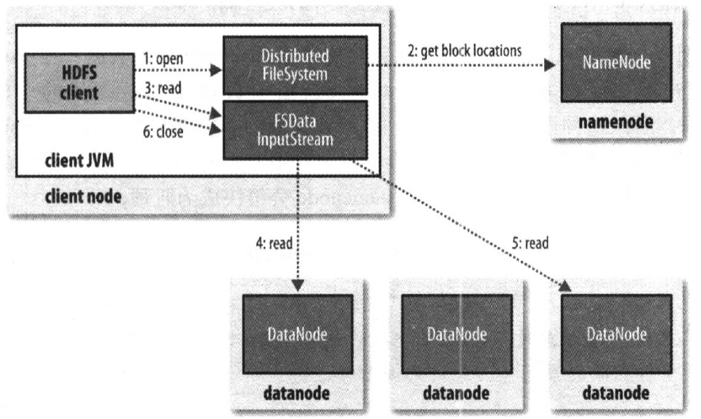
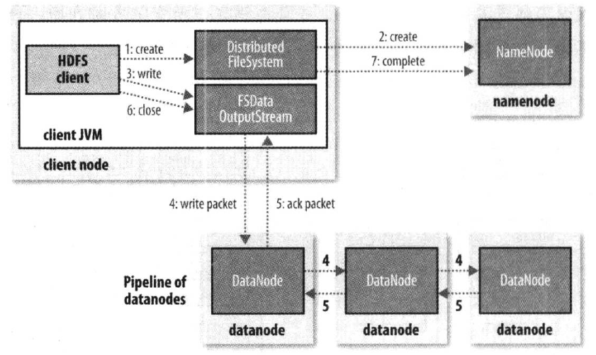

# HDFS

## 一、简介

Hadoop分布式文件系统（HDFS）是一种分布式文件系统，设计用于在商用硬件上运行。它与现有的分布式文件系统有许多相似之处。但是，与其他分布式文件系统的差异很大。HDFS具有高度容错能力，旨在部署在低成本硬件上。HDFS提供对应用程序数据的高吞吐量访问，适用于具有大型数据集的应用程序。HDFS放宽了一些POSIX要求，以实现对文件系统数据的流式访问。HDFS最初是作为Apache Nutch网络搜索引擎项目的基础设施而构建的。HDFS是Apache Hadoop Core项目的一部分。 

HDFS设计用于批处理而不是用户的交互式访问，重点是数据访问的高吞吐量而不是数据访问的低延迟。

## 二、原理

### 2.1 组成及架构

#### 2.1.1 基本组成

HDFS 采用Master/Slave的架构来存储数据，这种架构由四个部分组成，分别为HDFS Client、NameNode、DataNode和Secondary NameNode。 

**Client:**

- 1、文件切分。文件上传 HDFS 的时候，Client 将文件切分成 一个一个的Block，然后进行存储。
- 2、与 NameNode 交互，获取文件的位置信息。
- 3、与 DataNode 交互，读取或者写入数据。
- 4、Client 提供一些命令来管理 HDFS，比如启动或者关闭HDFS。
- 5、Client 可以通过一些命令来访问 HDFS。

**NameNode**：

- 1、管理 HDFS 的命名空间
- 2、管理数据块（Block）元数据信息
- 3、配置副本策略
- 4、处理客户端读写请求

**DataNode:**

- 1、存储实际的数据块
- 2、执行数据块的读/写操作
- 3、向NameNode汇报Block信息
- 4、每3秒向NameNode发送心跳信息，如果NN10分钟没有收到DN的心跳，则认为DN已经丢失，需要复制其上的Block到其他的DN上

**Secondary NameNode:**

- 1、定期合并 fsimage和fsedits，并推送给NameNode
- 2、在紧急情况下，可辅助恢复 NameNode

#### 2.1.2 架构

HDFS具有主/从架构。HDFS集群由NameNode和DataNode组成。NameNode由单个NameNode，管理文件系统命名空间的主服务器和管理客户端对文件的访问组成。此外，还有许多DataNode，通常是群集中每个节点一个，用于管理连接到它们运行的节点的存储。HDFS公开文件系统命名空间，并允许用户数据存储在文件中。在内部，文件被分成一个或多个块，这些块存储在一组DataNode中。NameNode执行文件系统命名空间操作，如打开，关闭和重命名文件和目录。它还确定了块到DataNode的映射。DataNode负责提供来自文件系统客户端的读写请求，块创建，删除。

 

#### 2.1.3 SecondaryNameNode的职责？

它的职责为定期合并NameNode的edits到fsimage中文件中，从而减少NameNode启动时间。首先Secondary NameNode定时到NameNode中拉取edits日志文件，并更新到fsimage上，将更新后的fsimage传回NameNode中。NameNode在下次重启时会使用这个新的fsimage文件，从而减少重启的时间。Secondary NameNode的整个目的是在HDFS中提供一个检查点，因此也被称为检查点节点。

**附：官网对Secondary NameNode的描述**

NameNode将元数据的修改变化添加到本地文件系统的 edits 日志。当NameNode启动时，它从fsimage读取HDFS状态，然后从 edits 日志文件中读取元数据的修改信息。再将新的HDFS状态写入fsimage并使用空的edits文件开始正常操作。由于NameNode仅在启动期间合并 fsimage 和 edits 日志文件，因此 edits 日志文件在繁忙的群集上可能会随着时间的推移而变得非常大。较大的 edits 日志文件的另一个副作用是下次重新启动NameNode需要更长的时间。

辅助NameNode定期合并fsimage和edits日志文件，并使 edits 日志大小保持在限制范围内。它通常在与主NameNode不同的机器上运行，因为它的内存要求与主NameNode的相同。

辅助NameNode上开始checkpoint由两个配置参数控制。

* `dfs.namenode.checkpoint.period`，默认设置为1小时，指定两个连续checkpoint之间的最大延迟
* `dfs.namenode.checkpoint.txns`，默认设置为1百万，定义NameNode上的未经检查事务的数量，这将强制进行checkpoint，即使尚未达到checkpoint的周期。

辅助NameNode将最新检查点存储在一个目录中，该目录的结构与主NameNode的相同。因此，检查点的fsimage始终可以被主NameNode读取。

### 2.2 优缺点比较

#### 2.2.1 HDFS优点

**1、高容错性**

* 数据自动保存多个副本。它通过增加副本的形式，提高容错性；
* 某一个副本丢失以后，它可以自动恢复。

**2、适合批处理**

* 移动计算而不是移动数据；
* 把数据位置暴露给计算框架。

**3、适合大数据处理**

* 能够处理数据达到 GB、TB、甚至PB级别的数据；
* 能够处理百万规模以上的文件数量，数量相当之大；
* 能够处理10K节点的规模。

**4、流式文件访问**
* 一次写入，多次读取。文件一旦写入不能修改，只能追加；
* 能保证数据的一致性。

**5、可构建在廉价机器上**
* 它通过多副本机制，提高可靠性；
* 它提供了容错和恢复机制。比如某一个副本丢失，可以通过其它副本来恢复。 

#### 2.2.2 HDFS缺点（不适用适用HDFS的场景 ）

**1、低延时数据访问** 
* 比如毫秒级的来存储数据，这是不行的，它做不到。
* 适合高吞吐率的场景，就是在某一时间内写入大量的数据。但是它在低延时的情况下是不行的，比如毫秒级以内读取数据，这样它是很难做到的。

**2、小文件存储** 
* 存储大量小文件的话，它会占用 NameNode大量的内存来存储文件、目录和块信息。这样是不可取的，因为NameNode的内存总是有限的。
* 小文件存储的寻道时间会超过读取时间，它违反了HDFS的设计目标。

**3、并发写入、文件随机修改**
* 一个文件只能有一个写，不允许多个线程同时写。 
* 仅支持数据 append（追加），不支持文件的随机修改。

### 2.3 读写流程

#### 2.3.1 读流程

1、首先调用FileSystem对象的open方法，其实获取的是一个DistributedFileSystem的实例。

2、DistributedFileSystem通过RPC(远程过程调用)获得文件的第一批block的locations，同一block按照重复数会返回多个locations，这些locations按照Hadoop拓扑结构排序，距离客户端近的排在前面。

3、前两步会返回一个FSDataInputStream对象，该对象会被封装成 DFSInputStream对象，DFSInputStream可以方便的管理datanode和namenode数据流。客户端调用read方 法，DFSInputStream就会找出离客户端最近的datanode并连接datanode。

4、数据从datanode源源不断的流向客户端。

5、如果第一个block块的数据读完了，就会关闭指向第一个block块的datanode连接，接着读取下一个block块。这些操作对客户端来说是透明的，从客户端的角度来看只是读一个持续不断的流。

6、如果第一批block都读完了，DFSInputStream就会去namenode拿下一批blocks的location，然后继续读，如果所有的block块都读完，这时就会关闭掉所有的流。 

#### 2.3.2 写流程

1、客户端通过调用 DistributedFileSystem 的create方法，创建一个新的文件。

2、DistributedFileSystem 通过 RPC（远程过程调用）调用 NameNode，去创建一个没有blocks关联的新文件。创建前，NameNode 会做各种校验，比如文件是否存在，客户端有无权限去创建等。如果校验通过，NameNode 就会记录下新文件，否则就会抛出IO异常。

3、前两步结束后会返回 FSDataOutputStream 的对象，和读文件的时候相似，FSDataOutputStream 被封装成 DFSOutputStream，DFSOutputStream 可以协调 NameNode和 DataNode。客户端开始写数据到DFSOutputStream,DFSOutputStream会把数据切成一个个小packet，然后排成队列 data queue。

4、DataStreamer 会去处理接受 data queue，它先问询 NameNode 这个新的 block 最适合存储的在哪几个DataNode里，比如重复数是3，那么就找到3个最适合的 DataNode，把它们排成一个 pipeline。DataStreamer 把 packet 按队列输出到管道的第一个 DataNode 中，第一个 DataNode又把 packet 输出到第二个 DataNode 中，以此类推。

5、DFSOutputStream 还有一个队列叫 ack queue，也是由 packet 组成，等待DataNode的收到响应，当pipeline中的所有DataNode都表示已经收到的时候，这时akc queue才会把对应的packet包移除掉。

6、客户端完成写数据后，调用close方法关闭写入流。

7.DataStreamer 把剩余的包都刷到 pipeline 里，然后等待 ack 信息，收到最后一个 ack 后，通知 DataNode 把文件标示为已完成。

### 2.4 元数据的持久化策略

HDFS名称空间由NameNode存储。NameNode使用名为EditLog的事务日志来持久记录文件系统元数据发生的每个更改。例如，在HDFS中创建新文件会导致NameNode将记录插入EditLog，以指示此情况。同样，更改文件的复制因子会导致将新记录插入EditLog。NameNode使用其本地主机OS文件系统中的文件来存储EditLog。整个文件系统命名空间（包括块到文件和文件系统属性的映射）存储在名为FsImage的文件中。FsImage也作为文件存储在NameNode的本地文件系统中。

NameNode在整个内存中保存整个文件系统命名空间和文件Blockmap的映像。当NameNode启动，或者检查点由可配置的阈值触发时，它从磁盘读取FsImage和EditLog，将EditLog中的所有事务应用到FsImage的内存中表示，并将此新版本刷新为磁盘上的新FsImage。然后它可以截断旧的EditLog，因为它的事务已应用于持久性FsImage。此过程称为检查点。检查点的目的是通过获取文件系统元数据的快照并将其保存到FsImage来确保HDFS具有文件系统元数据的一致视图。尽管读取FsImage是有效的，但直接对FsImage进行增量编辑效率不高。我们不会修改每个编辑的FsImage，而是在Editlog中保留编辑内容。在检查点期间，Editlog的更改将应用于FsImage。可以在给定的时间间隔触发检查点（`dfs.namenode.checkpoint.period`）以秒为单位表示，或者在累积了给定数量的文件系统事务之后（`dfs.namenode.checkpoint.txns`）。如果同时设置了这两个属性，则要达到的第一个阈值将触发检查点。

DataNode将HDFS数据存储在其本地文件系统中的文件中。DataNode不了解HDFS文件。它将每个HDFS数据块存储在其本地文件系统中的单独文件中。DataNode不会在同一目录中创建所有文件。相反，它使用启发式方法来确定每个目录的最佳文件数，并适当地创建子目录。在同一目录中创建所有本地文件并不是最佳选择，因为本地文件系统可能无法有效地支持单个目录中的大量文件。当DataNode启动时，它会扫描其本地文件系统，生成与每个本地文件对应的所有HDFS数据块的列表，并将此报告发送到NameNode。该报告称为*Blockreport*。

### 2.5 数据复制

#### 2.5.1 概述

HDFS被设计成能够在一个大集群中跨机器可靠地存储超大文件。它将每个文件存储成一系列的数据块，除了最后一个，所有的数据块都是同样大小的。为了容错，文件的所有数据块都会有副本。每个文件的数据块大小和副本系数都是可配置的。应用程序可以指定某个文件的副本数目。副本系数可以在文件创建的时候指定，也可以在之后改变。HDFS中的文件都是一次性写入的，并且严格要求在任何时候只能有一个写入者。

Namenode全权管理数据块的复制，它周期性地从集群中的每个Datanode接收心跳信号和块状态报告(Blockreport)。接收到心跳信号意味着该Datanode节点工作正常。块状态报告包含了一个该Datanode上所有数据块的列表。

 

#### 2.5.2 副本放置策略

> * [r2.8.0](http://hadoop.apache.org/docs/r2.8.0/hadoop-project-dist/hadoop-hdfs/HdfsDesign.html#Replica_Placement:_The_First_Baby_Steps)
> * [r2.8.2](http://hadoop.apache.org/docs/r2.8.2/hadoop-project-dist/hadoop-hdfs/HdfsDesign.html#Replica_Placement:_The_First_Baby_Steps) 

**版本间的策略差异：**

在2.8.2之前，将第1个副本放在本地机架的一个节点上，第2个副本放在本地机架的另一个节点上，第3个副本放在另一个机架中一个节点上，第4个及以后的副本随机放置。

自2.8.2以后，将第1个副本放在本地机架的一个节点上，第2个副本放在另一个机架上的一个节点上，第3个副本放在与第2个副本同机架的不同节点上，第4个及以后的副本随机放置。

**优点：**
这种副本策略可以减少机架间写入流量，从而提高写入性能。机架故障的可能性远小于节点故障的可能性，此策略不会影响数据可靠性和可用性保证。但是，它确实减少了在创建副本时读取数据使用的聚合网络带宽，因为块只放在两个唯一的机架而不是三个。

**详细阐述：**

副本的存放是HDFS可靠性和性能的关键。优化的副本存放策略是HDFS区分于其他大部分分布式文件系统的重要特性。这种特性需要做大量的调优，并需要经验的积累。HDFS采用一种称为机架感知(rack-aware)的策略来改进数据的可靠性、可用性和网络带宽的利用率。目前实现的副本存放策略只是在这个方向上的第一步。实现这个策略的短期目标是验证它在生产环境下的有效性，观察它的行为，为实现更先进的策略打下测试和研究的基础。

大型HDFS实例一般运行在跨越多个机架的计算机组成的集群上，不同机架上的两台机器之间的通讯需要经过交换机。在大多数情况下，同一个机架内的两台机器间的带宽会比不同机架的两台机器间的带宽大。

通过一个机架感知的过程，Namenode可以确定每个Datanode所属的机架id。一个简单但没有优化的策略就是将副本存放在不同的机架上。这样可以有效防止当整个机架失效时数据的丢失，并且允许读数据的时候充分利用多个机架的带宽。这种策略设置可以将副本均匀分布在集群中，有利于当组件失效情况下的负载均衡。但是，因为这种策略的一个写操作需要传输数据块到多个机架，这增加了写的代价。

在大多数情况下，副本系数是3，HDFS的存放策略是将一个副本存放在本地机架的节点上，一个副本放在同一机架的另一个节点上，最后一个副本放在不同机架的节点上。这种策略减少了机架间的数据传输，这就提高了写操作的效率。机架的错误远远比节点的错误少，所以这个策略不会影响到数据的可靠性和可用性。于此同时，因为数据块只放在两个（不是三个）不同的机架上，所以此策略减少了读取数据时需要的网络传输总带宽。在这种策略下，副本并不是均匀分布在不同的机架上。三分之一的副本在一个节点上，三分之二的副本在一个机架上，其他副本均匀分布在剩下的机架中，这一策略在不损害数据可靠性和读取性能的情况下改进了写的性能。

#### 2.5.3 副本选择

为了降低整体的带宽消耗和读取延时，HDFS会尽量让读取程序读取离它最近的副本。如果在读取程序的同一个机架上有一个副本，那么就读取该副本。如果一个HDFS集群跨越多个数据中心，那么客户端也将首先读本地数据中心的副本。

#### 2.5.4 安全模式

启动时，NameNode进入一个名为Safemode的特殊状态。当NameNode处于Safemode状态时，不会发生数据块的复制。NameNode从DataNode接收Heartbeat和Blockreport消息。Blockreport包含DataNode托管的数据块列表。每个块都有指定的最小副本数。当使用NameNode检入该数据块的最小副本数时，会认为该块是安全复制的。在可配置百分比的安全复制数据块使用NameNode（再加上30秒）检入后，NameNode退出Safemode状态。然后，它确定仍然具有少于指定数量的副本的数据块列表（如果有）。然后，NameNode将这些块复制到其他DataNode。 

- NameNode在启动的时候会进入一个称为安全模式的特殊状态，它首先将映像文件（fsimage）载入内存，并执行编辑日志（edits）中的各项操作；
- 一旦在内存中成功建立文件系统元数据映射，则创建一个新的fsimage文件（这个操作不需要SecondNameNode来做）与一个空的编辑日志；
- 此刻namenode运行在安全模式，即namenode的文件系统对于客户端来说是只读的，显示目录、显示文件内容等，写、删除、重命名都会失败；
- 在此阶段namenode搜集各个datanode的报告，当数据块达到最小副本数以上时，会被认为是“安全”的，在一定比例的数据块被认为是安全的以后（可设置），再过若干时间，安全模式结束；
- 当检测到副本数不足数据块时，该块会被复制，直到达到最小副本数，系统中数据块的位置并不是由namenode维护的，而是以块列表形式存储在datanode中。

### 2.6 数据组织

#### 2.6.1 数据块

HDFS被设计成支持大文件，适用HDFS的是那些需要处理大规模的数据集的应用。这些应用都是只写入数据一次，但却读取一次或多次，并且读取速度应能满足流式读取的需要。HDFS支持文件的“一次写入多次读取”语义。一个典型的数据块大小是256MB。因而，HDFS中的文件总是按照256M被切分成不同的块，每个块尽可能地存储于不同的Datanode中。

#### 2.6.2 分段

客户端创建文件的请求其实并没有立即发送给Namenode，事实上，在刚开始阶段HDFS客户端会先将文件数据缓存到本地的一个临时文件。应用程序的写操作被透明地重定向到这个临时文件。当这个临时文件累积的数据量超过一个数据块的大小，客户端才会联系Namenode。Namenode将文件名插入文件系统的层次结构中，并且分配一个数据块给它。然后返回Datanode的标识符和目标数据块给客户端。接着客户端将这块数据从本地临时文件上传到指定的Datanode上。当文件关闭时，在临时文件中剩余的没有上传的数据也会传输到指定的Datanode上。然后客户端告诉Namenode文件已经关闭。此时Namenode才将文件创建操作提交到日志里进行存储。如果Namenode在文件关闭前宕机了，则该文件将丢失。

上述方法是对在HDFS上运行的目标应用进行认真考虑后得到的结果。这些应用需要进行文件的流式写入。如果不采用客户端缓存，由于网络速度和网络堵塞会对吞估量造成比较大的影响。这种方法并不是没有先例的，早期的文件系统，比如AFS，就用客户端缓存来提高性能。为了达到更高的数据上传效率，已经放松了POSIX标准的要求。

#### 2.6.3 管道复制

当客户端向HDFS文件写入数据的时候，一开始是写到本地临时文件中。**假设该文件的副本系数设置为3，当本地临时文件累积到一个数据块的大小时，客户端会从Namenode获取一个Datanode列表用于存放副本。**然后客户端开始向第一个Datanode传输数据，第一个Datanode一小部分一小部分(4 KB)地接收数据，将每一部分写入本地仓库，并同时传输该部分到列表中第二个Datanode节点。第二个Datanode也是这样，一小部分一小部分地接收数据，写入本地仓库，并同时传给第三个Datanode。最后，第三个Datanode接收数据并存储在本地。因此，Datanode能流水线式地从前一个节点接收数据，并在同时转发给下一个节点，数据以流水线的方式从前一个Datanode复制到下一个。

## 三、特性

### 3.1 健壮性

#### 3.1.1 DataNode热插拔驱动器

Datanode支持热插拔驱动器。可以添加或替换HDFS数据卷，而不必不关闭DataNode。下面简要介绍典型的热插拔驱动程序：

- 如果存在新的存储目录，则应格式化它们并适当地装载它们；
- 将数据卷目录更新到DataNode的配置dfs.datanode.data.dir中；
- 通过运行dfsadmin -reconfig datanode HOST：PORT start来使我们配置的目录生效，并且可以使用dfsadmin -reconfig datanode HOST：PORT status查询重新配置任务的运行状态；
- 一旦重新配置任务完成，我们就可以安全地卸载、删除数据卷目录并物理删除磁盘。

#### 3.1.2 负载均衡

HDFS的架构支持数据均衡策略。如果某个Datanode节点上的空闲空间低于特定的临界点，按照均衡策略系统就会自动地将数据从这个Datanode移动到其他空闲的Datanode。在对特定文件的突然高需求的情况下，此方案可以动态地创建附加的副本并重新平衡群集中的其他数据。

#### 3.1.3 平衡器

HDFS的数据也许并不是非常均匀的分布在各个DataNode中。一个常见的原因是在现有的集群上经常会增添新的DataNode节点。当新增一个数据块（一个文件的数据被保存在一系列的块中）时，NameNode在选择DataNode接收这个数据块之前，会考虑到很多因素。其中的一些考虑的是：

- 将数据块的一个副本放在正在写这个数据块的节点上；
- 尽量将数据块的不同副本分布在不同的机架上，这样集群可在完全失去某一机架的情况下还能存活；
- 一个副本通常被放置在和写文件的节点同一机架的某个节点上，这样可以减少跨越机架的网络I/O；
- 尽量均匀地将HDFS数据分布在集群的DataNode中。

### 3.2 数据完整性

#### 3.2.1 概述

从某个Datanode获取的数据块有可能是损坏的，损坏可能是由Datanode的存储设备错误、网络错误或者软件bug造成的。HDFS客户端软件实现了对HDFS文件内容的校验和(checksum)检查。当客户端创建一个新的HDFS文件，会计算这个文件每个数据块的校验和，并将校验和作为一个单独的隐藏文件保存在同一个HDFS名字空间下。当客户端获取文件内容后，它会检验从Datanode获取的数据跟相应的校验和文件中的校验和是否匹配，如果不匹配，客户端可以选择从其他Datanode获取该数据块的副本。

#### 3.2.2 回收站机制

如果启用了回收站功能，FS Shell删除的文件不会立即从HDFS中删除。而是将其移动到回收目录（每个用户在/user /<username>/.Trash下都有自己的回收目录）。只要文件保留在回收站中，文件就可以快速恢复。

最近删除的文件移动到当前回收目录（/user/<username>/.Trash/Current），并在可配置的时间间隔内，HDFS创建对/user/<username>/.Trash/<date>目录下的一个检查点，并在过期后删除旧检查点。

当文件在回收站期满之后，NameNode将从HDFS命名空间中删除该文件。删除文件会导致与该文件关联的块被释放。需要说明的是，文件被用户删除的时间和对应的释放空间的时间之间有一个明显的时间延迟。

#### 3.2.3 减少副本

当文件的副本因子减小时，NameNode选择可以删除的多余副本。下一个心跳将此信息传输到DataNode。DataNode然后删除相应的块并且释放对应的空间。同样，在设置副本因子完成和集群中出现新的空间之间有个时间延迟。

#### 3.2.4 元数据磁盘错误

FsImage和Edits是HDFS的核心数据结构。如果这些文件损坏了，整个HDFS实例都将失效。因而，Namenode可以配置成支持维护多个FsImage和Edits的副本。任何对FsImage或者Edits的修改，都将同步到它们的副本上。这种多副本的同步操作可能会降低Namenode每秒处理的命名空间事务数量。然而这个代价是可以接受的，因为即使HDFS的应用是数据密集型的，它们的元数据信息的量也不会很大。当Namenode重启的时候，它会选取最近的完整的FsImage和Edits来使用。

#### 3.2.5 检查点节点

NameNode采用两个文件来保存命名空间的信息：fsimage，它是最新的已执行检查点的命名空间的信息：edits，它是执行检查点后命名空间变化的日志文件。当NameNode启动时，fsimage和edits合并，提供一个最新的文件系统的metadata，然后NameNode将新的HDFS状态写入fsimage，并开始一个新的edits日志。

Checkpoint节点周期性地创建命名空间的检查点。它从NameNode下载fsimage和edits，在本地合并它们，并将其发回给活动的NameNode。Checkpoint节点通常与NameNode不在同一台机器上，因为它们有同样的内存要求。Checkpoint节点由配置文件中的bin/hdfs namenode –checkpoint来启动。

Checkpoint(或Backup)节点的位置以及附带的web接口由 `dfs.namenode.backup.address` 和 `dfs.namenode.backup.http-address` 参数指定。

Checkpoint进程的运行受两个配置参数控制：

- `dfs.namenode.checkpoint.period`，两次连续的检查点之间的最大的时间间隔，缺省值是1小时；
- `dfs.namenode.checkpoint.txns`，最大的没有执行检查点的事务数目，默认设置为1百万，也就是Edits中的事务条数达到1百万就会触发一次合并，即使未达到检查点期间；

Checkpoint节点上保存的最新的检查点，其目录结构与NameNode上一样，这样，如果需要，NameNode总是可以读取这上面的已执行检查点的文件映像。多个Checkpoint节点可以在集群的配置文件中指定。

#### 3.2.6 备份节点

Backup节点与Checkpoint节点提供同样的执行检查点功能，只不过它还在内存中保存一份最新的命名空间的的拷贝，该拷贝与NameNode中的保持同步。除了接收NameNode中发送的edits并把它保存到磁盘之外，Backup还将edits用到自己的内存中，因而创建出一份命名空间的备份。

因为Backup节点在内存中保持有最新的命名空间的状态，因此它不需要从NameNode下载fsimage和edits文件来创建一个检查点，而这是Checkpoint节点或备用NameNode所必需的步骤。Backup节点的检查点进程更高效，因为它只需要将命名空间信息保存到本地的fsimage文件并重置edits就可以了。

由于Backup节点内存中维护了一份命名空间的拷贝，它的内存要求与NameNode一致。NameNode同一时刻只支持一个Backup节点。如果Backup在用，则不能注册Checkpont节点。

Backup节点的配置与Checkpoint节点一样，它采用`bin/hdfs namenode –backup`启动。Backup(或Checkup)节点的位置及其web接口由配置参数`dfs.namenode.backup.address`和 `dfs.namenode.backup.http-address`指定。

使用Backup节点，NameNode就可以选择不进行存储，而将保持命名空间状态的责任交给Backup节点。为此，在NameNode的配置中，采用选项`-importCheckpoint`来启动NameNode，并且不设置edits的存储位置选项`dfs.namenode.edits.dir`。

#### 3.2.7 导入检查点

如果其它所有的映像文件和edits都丢失了，可以将最后的检查点导入到NameNode，为此，需要以下步骤：

创建一个空目录，在dfs.namenode.name.dir项中配置为该目录；

设置`dfs.namenode.checkpoint.dir`为检查点目录；

采用`-importCheckpoint`选项来启动NameNode。

NameNode将从`dfs.namenode.checkpoint.dir`设置的目录中上载检查点，并将其保存在`dfs.namenode.name.dir`指定的目录中。如果`dfs.namenode.name.dir`中存在一个映像文件，NameNode就会启动失败，NameNode要验证`dfs.namenode.checkpoint.dir`中的映像文件是否有问题，但在任何情况下，都不会修改该文件。

#### 3.2.8 恢复模式

通常，你要配置多个metadata存储位置，当一个存储位置崩溃后，你可以从其它位置读取到metadata。但是，如果仅有的一个存储位置崩溃后怎么办呢？在这种情况下，有一个特别的NameNode启动模式，叫恢复模式，允许你恢复大部分数据。你可以像这样启动恢复模式：`namenode –recover`，在恢复模式时，NameNode以命令行的方式与你交互，显示你可能采取的恢复数据的措施。如果你不想采用交互模式，你可以加上选项`-force`，这个选项将强制选取第一个选择恢复，通常，这是最合理的选择。由于恢复模式可能使数据丢失，你应该在使用它之前备份edits日志文件和fsimage。

#### 3.2.9 快照

> https://hadoop.apache.org/docs/r2.9.2/hadoop-project-dist/hadoop-hdfs/HdfsSnapshots.html

HDFS快照是文件系统的只读时间点副本。利用快照，可以让HDFS在数据损坏时恢复到过去一个已知正确的时间点。可以对文件系统的子树或整个文件系统进行快照。快照的一些常见用例是数据备份，防止用户错误和灾难恢复。

**HDFS快照的实现是高效的：**

- 快照创建是即时的：成本是O(1)，不包括inode查找时间；
- 仅当相对于快照进行修改时才使用附加内存：内存使用为O(M)，其中M是修改的文件/目录的数量；
- 不复制datanode中的块：快照文件记录块列表和文件大小，没有数据复制；
- 快照不会对常规HDFS操作产生不利影响：按照时间倒序顺序记录修改，以便可以直接访问当前数据。通过从当前数据中减去修改来计算快照数据。

**Snapshottable目录：**

一旦目录设置为可快照，就可以对任何目录进行快照。snaphottable目录能够容纳65,536个同步快照。可快照目录的数量没有限制。管理员可以将任何目录设置为可快照。如果快照目录中有快照，则在删除所有快照之前，不能删除或重命名目录。

当前不允许嵌套snaphottable目录。换句话说，如果一个目录的父目录或子目录是一个snaphottable目录，则不能将其设置为snaphottable。

## 四、HDFS High Availability(HA)

### 4.1 使用Quorum Journal Manager(QJM)的HA

#### 4.1.1 架构

在典型的HA群集中，两台独立的计算机配置为NameNode。在任何时间点，其中一个NameNode处于*活动*状态，另一个处于*待机*状态。Active NameNode负责集群中的所有客户端操作，而Standby只是充当从属服务器，维持足够的状态以在必要时提供快速故障转移。

为了使备用节点保持其状态与活动节点同步，两个节点都与一组称为“JournalNodes”（JN）的单独守护进程通信。当Active节点执行任何名称空间修改时，它会将修改记录持久地记录到大多数这些JN中。待机节点能够从JN读取编辑，并且不断观察它们对编辑日志的更改。当备用节点看到编辑时，它会将它们应用到自己的命名空间。如果发生故障转移，Standby将确保在将自身升级为Active状态之前已从JournalNodes读取所有编辑内容。这可确保在发生故障转移之前完全同步命名空间状态。

为了提供快速故障转移，备用节点还必须具有关于群集中块的位置的最新信息。为了实现这一点，DataNode配置了两个NameNode的位置，并向两者发送块位置信息和心跳。

对于HA群集的正确操作而言，一次只有一个NameNode处于活动状态至关重要。否则，命名空间状态将在两者之间快速分歧，冒着数据丢失或其他不正确结果的风险。为了确保这个属性并防止所谓的“裂脑情景”，JournalNodes只允许一个NameNode一次成为一个作家。在故障转移期间，要激活的NameNode将简单地接管写入JournalNodes的角色，这将有效地阻止其他NameNode继续处于Active状态，从而允许新的Active安全地进行故障转移。

#### 4.1.2 硬件资源

要部署HA群集，您应准备以下内容：

* **NameNode计算机** - 运行Active和Standby NameNode的计算机应具有彼此相同的硬件，以及与非HA集群中使用的硬件等效的硬件。
* **JournalNode计算机** - 运行JournalNodes的计算机。JournalNode守护程序相对轻量级，因此这些守护程序可以合理地与其他Hadoop守护程序并置在机器上，例如NameNodes，JobTracker或YARN ResourceManager。**注意：**必须至少有3个JournalNode守护进程，因为编辑日志修改必须写入大多数JN。这将允许系统容忍单个机器的故障。您还可以运行3个以上的JournalNodes，但为了实际增加系统可以容忍的失败次数，您应该运行奇数个JN（即3,5,7等）。请注意，当使用N个JournalNodes运行时，系统最多可以容忍（N-1）/ 2个故障并继续正常运行。

请注意，在HA群集中，备用NameNode还会执行命名空间状态的检查点，因此无需在HA群集中运行Secondary NameNode，CheckpointNode或BackupNode。事实上，这样做会是一个错误。这还允许重新配置启用HA的HDFS群集的人员启用HA，以重用他们之前专用于Secondary NameNode的硬件。

#### 4.1.3 详细配置

参考 https://hadoop.apache.org/docs/r2.9.2/hadoop-project-dist/hadoop-hdfs/HDFSHighAvailabilityWithQJM.html

### 4.2 使用NFS的HA

#### 4.2.1 架构

在典型的HA群集中，两台独立的计算机配置为NameNode。在任何时间点，其中一个NameNode处于*活动*状态，另一个处于*待机*状态。Active NameNode负责集群中的所有客户端操作，而Standby只是充当从属服务器，维持足够的状态以在必要时提供快速故障转移。

为了使备用节点保持其状态与活动节点同步，当前实现要求两个节点都可以访问共享存储设备上的目录（例如，来自NAS的NFS安装）。在将来的版本中可能会放宽此限制。

当Active节点执行任何名称空间修改时，它会将修改记录持久地记录到存储在共享目录中的编辑日志文件中。Standby节点不断观察此目录以进行编辑，并在查看编辑时将其应用于自己的命名空间。如果发生故障转移，备用数据库将确保在将自身升级为活动状态之前已从共享存储中读取所有编辑内容。这可确保在发生故障转移之前完全同步命名空间状态。

为了提供快速故障转移，备用节点还必须具有关于群集中块的位置的最新信息。为了实现这一点，DataNode配置了两个NameNode的位置，并向两者发送块位置信息和心跳。

对于HA群集的正确操作而言，一次只有一个NameNode处于活动状态至关重要。否则，命名空间状态将在两者之间快速分歧，冒着数据丢失或其他不正确结果的风险。为了确保此属性并防止所谓的“裂脑情景”，管理员必须为共享存储配置至少一种*防护方法*。在故障转移期间，如果无法验证先前的活动节点是否已放弃其活动状态，则防护进程负责切断先前Active对共享编辑存储的访问。这可以防止它对命名空间进行任何进一步的编辑，从而允许新的Active安全地进行故障转移。

#### 4.2.2 硬件资源

要部署HA群集，您应准备以下内容：

* **NameNode计算机** - 运行Active和Standby NameNode的计算机应具有彼此相同的硬件，以及与非HA集群中使用的硬件等效的硬件。
* **共享存储** - 您需要拥有一个共享目录，NameNode计算机都可以对其进行读/写访问。通常，这是一个支持NFS的远程文件管理器，并安装在每个NameNode计算机上。目前仅支持单个共享编辑目录。因此，系统的可用性受到此共享编辑目录的可用性的限制，因此为了移除所有单点故障，共享编辑目录需要冗余。具体而言，存储的多个网络路径以及存储本身（磁盘，网络和电源）的冗余。由于这一点，建议共享存储服务器是高质量的专用NAS设备，而不是简单的Linux服务器。

请注意，在HA群集中，备用NameNode还会执行命名空间状态的检查点，因此无需在HA群集中运行Secondary NameNode，CheckpointNode或BackupNode。事实上，这样做会是一个错误。这还允许重新配置启用HA的HDFS群集的人员启用HA，以重用他们之前专用于Secondary NameNode的硬件。

#### 4.2.3 详细配置

参考 https://hadoop.apache.org/docs/r2.9.2/hadoop-project-dist/hadoop-hdfs/HDFSHighAvailabilityWithNFS.html

## 五、HDFS 联邦

> 参考：https://hadoop.apache.org/docs/r2.9.2/hadoop-project-dist/hadoop-hdfs/Federation.html

### 5.1 背景

虽然HDFS HA解决了“单点故障”问题，但是在系统扩展性、整体性能和隔离性方面仍然存在问题。

1.  系统扩展性方面，元数据存储在NN内存中，受内存上限的制约。
1.  整体性能方面，吞吐量受单个NN的影响。
1.  隔离性方面，一个程序可能会影响其他运行的程序，如一个程序消耗过多资源导致其他程序无法顺利运行。HDFS HA本质上还是单名称节点。

HDFS联邦可以解决以上三个方面问题。

 

HDFS有两个主要层：

* 命名空间

  * 由目录，文件和块组成。
  * 它支持所有与命名空间相关的文件系统操作，例如创建，删除，修改和列出文件和目录。

* 块存储服务，包括两部分：

  * 块管理（在Namenode中执行）
    * 通过处理注册和定期心跳来提供Datanode集群成员资格。
    * 进程阻止报告并维护块的位置。
    * 支持块相关操作，如创建，删除，修改和获取块位置。
    * 管理副本放置，阻止复制下的块的复制，并删除过度复制的块。
  * 存储 - 由Datanodes通过在本地文件系统上存储块并允许读/写访问来提供。

先前的HDFS架构仅允许整个群集使用单个命名空间。在该配置中，单个Namenode管理命名空间。HDFS Federation通过向HDFS添加对多个Namenode（命名空间）的支持来解决此限制。

### 5.2 多个名称节点/命名空间

为了横向扩展名称服务，联合使用多个独立的Namenodes /名称空间。Namenodes是联合的; Namenodes是独立的，不需要相互协调。Datanode用作所有Namenode的块的公共存储。每个Datanode都注册集群中的所有Namenode。Datanodes定期发送心跳和阻止报告。它们还处理来自Namenodes的命令。

用户可以使用[ViewF](https://hadoop.apache.org/docs/r2.9.2/hadoop-project-dist/hadoop-hdfs/ViewFs.html)来创建个性化命名空间视图。ViewFs类似于某些Unix / Linux系统中的客户端安装表。

 

**Block Pool（块池）**

块池是属于单个命名空间的一组块。Datanode存储集群中所有块池的块。每个Block Pool都是独立管理的。这允许命名空间为新块生成块ID，而无需与其他命名空间协调。Namenode故障不会阻止Datanode提供群集中的其他Namenode。

命名空间及其块池一起称为命名空间卷。它是一个独立的管理单位。删除Namenode /名称空间时，将删除Datanodes上的相应块池。在群集升级期间，每个命名空间卷都作为一个单元升级。

**ClusterID（集群ID）**

集群ID用于识别该集群中的所有节点。格式化Namenode时，将提供或自动生成此标识符。此ID应用于将其他Namenode格式化为群集。

### 5.3 优点

* 命名空间可伸缩性 - 联合添加命名空间水平扩展。通过允许将更多Namenode添加到群集，使用大量小文件的大型部署或部署可从命名空间扩展中受益。
* 性能 - 文件系统吞吐量不受单个Namenode的限制。向集群添加更多Namenode可扩展文件系统读/写吞吐量。
* 隔离 - 单个Namenode在多用户环境中不提供隔离。例如，实验应用程序可能会使Namenode过载并减慢生产关键应用程序的速度。通过使用多个Namenode，可以将不同类别的应用程序和用户隔离到不同的名称空间。

### 5.4 配置和管理

参考 https://hadoop.apache.org/docs/r2.9.2/hadoop-project-dist/hadoop-hdfs/Federation.html#Federation_Configuration

