[TOC]

# Java

## 一、数据类型
### 1.1 基本数据类型
|类型|内容空间(bit)|最小值|最大值|默认值|包装类|
|:-|:-:|:-|:-|:-|:-|
|byte|8|Unicode0|Unicode$2^{16}-1$|(byte)0|Byte|
|char|16|-128|+127|'\u0000'|Character|
|short|16|$-2^{15}$|$2^{15}-1$|(short)0|Short|
|int|32|$-2^{31}$|$2^{31}-1$|0|Integer|
|long|64|$-2^{63}$|$2^{63}-1$|0L|Long|
|float|32|IEEE 754|IEEE 754|0.0f|Float|
|double|64|IEEE 754|IEEE 754|0.0d|Double|
|boolean|-|-|-|false|Boolean|

> Tips: The boolean data type has only two possible values: true and false. Use this data type for simple flags that track true/false conditions. This data type represents one bit of information, but its "size" isn't something that's precisely defined.（即与具体的JVM有关，1、4字节都可能）

### 1.2 变量和常量
* 变量: `类型 变量名`
* 常量: 使用关键词 `final` 仅在初始化时可被赋值
* 自定义常量:
    * `123` : 默认为`int`
    * `1.1` : 默认为`double`

### 1.3 缓冲池
new Integer(123) 与 Integer.valueOf(123) 的区别在于：
* new Integer(123) 每次都会新建一个对象；
* Integer.valueOf(123) 会使用缓存池中的对象，多次调用会取得同一个对象的引用。
``` java
Integer x = new Integer(123);
Integer y = new Integer(123);
System.out.println(x == y);    // false
Integer z = Integer.valueOf(123);
Integer k = Integer.valueOf(123);
System.out.println(z == k);   // true
```

valueOf() 方法的实现比较简单，就是先判断值是否在缓存池中，如果在的话就直接返回缓存池的内容。
```java
public static Integer valueOf(int i) {
    if (i >= IntegerCache.low && i <= IntegerCache.high)
        return IntegerCache.cache[i + (-IntegerCache.low)];
    return new Integer(i);
}
```

在 Java 8 中，Integer 缓存池的大小默认为 -128~127。
``` java
private static class IntegerCache {
	static final int low = -128;
	static final int high;
	static final Integer cache[];

	static {
		// high value may be configured by property
		int h = 127;
		String integerCacheHighPropValue =
			sun.misc.VM.getSavedProperty("java.lang.Integer.IntegerCache.high");
		if (integerCacheHighPropValue != null) {
			try {
				int i = parseInt(integerCacheHighPropValue);
				i = Math.max(i, 127);
				// Maximum array size is Integer.MAX_VALUE
				h = Math.min(i, Integer.MAX_VALUE - (-low) -1);
			} catch( NumberFormatException nfe) {
				// If the property cannot be parsed into an int, ignore it.
			}
		}
		high = h;

		cache = new Integer[(high - low) + 1];
		int j = low;
		for(int k = 0; k < cache.length; k++)
			cache[k] = new Integer(j++);

		// range [-128, 127] must be interned (JLS7 5.1.7)
		assert IntegerCache.high >= 127;
	}

	private IntegerCache() {}
}
```

编译器会在自动装箱过程调用 valueOf() 方法，因此多个 Integer 实例使用自动装箱来创建并且值相同，那么就会引用相同的对象。
```java
Integer m = 123;
Integer n = 123;
System.out.println(m == n); // true
```

以下基本数据类型的值在自动装箱时不会创建对象：
* boolean values true and false
* All byte values
* short values between -128 and 127
* int values between -128 and 127
* char in the range \u0000 to \u007F

## 二、运算符
* 算数运算符: `+ - * / %`
* 自增自减: `++ --`
* 关系运算符: `== > < >= <= !=`
* 逻辑运算符: `! &&(短路) ||(短路) & |` **注意判定短路现象**
* 按位操作符: `& | ~ ^`
* 移位操作符: `<< >> >>>(无符号右移，高位补0)`
* 三目运算符: `boolean-exp? value0 : value1`
* 赋值操作符: `+= -= *= /=`
* 逗号操作符: `,`

## 三、控制执行流程
* if条件语句
* switch多分支语句，支持的类型有: `byte short int char String enum`（可以使用常量）
* while循环语句
* do...while循环语句
* for循环语句
* break, continue
	* __break:__ 跳出当前的循环或条件语句块
	* __continue:__ 跳过后面的循环语句块，进行下一次迭代

## 四、String

### 4.1 概述
String 被声明为 final，因此它不可被继承。

内部使用 char 数组存储数据，该数组被声明为 final，这意味着 value 数组初始化之后就不能再引用其它数组。并且 String 内部没有改变 value 数组的方法，因此可以保证 String 不可变。
```java
public final class String
    implements java.io.Serializable, Comparable<String>, CharSequence {
    /** The value is used for character storage. */
    private final char value[];
```

### 4.2 String, StringBuilder, StringBuffer比较
1. 可变性
	* String 不可变
	* StringBuilder, StringBuffer 可变
2. 安全性
	* String 不可变，所以线程安全
	* StringBuilder 非线程安全
	* StringBuffer 线程安全，内部方法使用synchronized进行同步

### 4.3 String Pool（字符串常量池）
字符串常量池（String Pool）保存着所有字符串字面量（literal strings），这些字面量在编译时期就确定。不仅如此，还可以使用 String 的 intern() 方法在运行过程中将字符串添加到 String Pool 中。

当一个字符串调用 intern() 方法时，如果 String Pool 中已经存在一个字符串和该字符串值相等（使用 equals() 方法进行确定），那么就会返回 String Pool 中字符串的引用；否则，就会在 String Pool 中添加一个新的字符串，并返回这个新字符串的引用。

下面示例中，s1 和 s2 采用 new String() 的方式新建了两个不同字符串，而 s3 和 s4 是通过 s1.intern() 方法取得一个字符串引用。intern() 首先把 s1 引用的字符串放到 String Pool 中，然后返回这个字符串引用。因此 s3 和 s4 引用的是同一个字符串。
``` java
String s1 = new String("aaa");
String s2 = new String("aaa");
System.out.println(s1 == s2);           // false
String s3 = s1.intern();
String s4 = s1.intern();
System.out.println(s3 == s4);           // true
```

如果是采用 "bbb" 这种字面量的形式创建字符串，会自动地将字符串放入 String Pool 中。
``` java
String s5 = "bbb";
String s6 = "bbb";
System.out.println(s5 == s6);  // true
```

在 Java 7 之前，String Pool 被放在运行时常量池中，它属于永久代。而在 Java 7，String Pool 被移到堆中。这是因为永久代的空间有限，在大量使用字符串的场景下会导致 OutOfMemoryError 错误。

### 4.4 正则表达式

[在线测试工具](http://wpjam.qiniudn.com/tool/regexpal/)

**1. 匹配单个字符**

. 可以用来匹配任何的单个字符，但是在绝大多数实现里面，不能匹配换行符；

. 是元字符，表示它有特殊的含义，而不是字符本身的含义。如果需要匹配 . ，那么要用 \ 进行转义，即在 . 前面加上 \ 

**2. 匹配一组字符**

[ ] 定义一个字符集合；

0-9、a-z 定义了一个字符区间，区间使用 ASCII 码来确定，字符区间在 [ ] 中使用。

**-** 只有在 [ ] 之间才是元字符，在 [ ] 之外就是一个普通字符；

**^** 在 [ ] 中是取非操作。

**3. 使用元字符**

匹配空白字符

|  元字符 | 说明  |
| :---: | :---: |
|  \b | 回退（删除）一个字符   |
|  \f |  换页符 |
|  \n |  换行符 |
|  \r |  回车符 |
|  \t |  制表符 |
|  \v |  垂直制表符 |

\r\n 是 Windows 中的文本行结束标签，在 Unix/Linux 则是 \n。

\r\n\r\n 可以匹配 Windows 下的空白行，因为它将匹配两个连续的行尾标签，而这正是两条记录之间的空白行；

匹配特定的字符类别

* 数字元字符

|  元字符 | 说明  |
| :---: | :---: |
| \d  | 数字字符，等价于 [0-9]  |
| \D  | 非数字字符，等价于 [^0-9]   |

* 字母数字元字符

|  元字符 | 说明  |
| :---: | :---: |
| \w  |  大小写字母，下划线和数字，等价于 [a-zA-Z0-9\_] |
|  \W |  对 \w 取非 |

* 空白字符元字符

| 元字符  | 说明  |
| :---: | :---: |
|  \s | 任何一个空白字符，等价于 [\f\n\r\t\v]  |
| \S  |  对 \s 取非  |

\x 匹配十六进制字符，\0 匹配八进制，例如 \x0A 对应 ASCII 字符 10，等价于 \n。

**4. 重复匹配**
-  **\+**  匹配 1 个或者多个字符
-  **\*** 匹配 0 个或者多个
-  **?**  匹配 0 个或者 1 个

**5. 位置匹配**

单词边界
* \b 可以匹配一个单词的边界，边界是指位于 \w 和 \W 之间的位置；\B 匹配一个不是单词边界的位置。
* \b 只匹配位置，不匹配字符，因此 \babc\b 匹配出来的结果为 3 个字符。

字符串边界
* ^ 匹配整个字符串的开头，$ 匹配结尾。
* ^ 元字符在字符集合中用作求非，在字符集合外用作匹配字符串的开头。

分行匹配模式（multiline）下，换行被当做字符串的边界。

**6. 子表达式**

使用 ( ) 定义一个子表达式。子表达式的内容可以当成一个独立元素，即可以将它看成一个字符，并且使用 * 等元字符。

子表达式可以嵌套

**7. 回溯引用**

回溯引用使用 \n 来引用某个子表达式，其中 n 代表的是子表达式的序号，从 1 开始。它和子表达式匹配的内容一致，比如子表达式匹配到 abc，那么回溯引用部分也需要匹配 abc 。

示例，匹配HTML中合法的标签：
```
<(h[1-6])>\w*?<\/\1>
```

**8. 前后查找**

前后查找规定了匹配的内容首尾应该匹配的内容，但是又不包含首尾匹配的内容。向前查找用 ?= 来定义，它规定了尾部匹配的内容，这个匹配的内容在 ?= 之后定义。所谓向前查找，就是规定了一个匹配的内容，然后以这个内容为尾部向前面查找需要匹配的内容。向后匹配用 ?<= 定义（注: javaScript 不支持向后匹配, java 对其支持也不完善）。

**9. 嵌入条件**

回溯引用条件

条件判断为某个子表达式是否匹配，如果匹配则需要继续匹配条件表达式后面的内容。

子表达式 (\\() 匹配一个左括号，其后的 ? 表示匹配 0 个或者 1 个。 ?(1) 为条件，当子表达式 1 匹配时条件成立，需要执行 ) 匹配，也就是匹配右括号。
```
(\()?abc(?(1)\))
```

前后查找条件

条件为定义的首尾是否匹配，如果匹配，则继续执行后面的匹配。注意，首尾不包含在匹配的内容中。

?(?=-) 为前向查找条件，只有在以 - 为前向查找的结尾能匹配 \d{5} ，才继续匹配 -\d{4} 。

```
\d{5}(?(?=-)-\d{4})
```


## 五、Object的通用方法
### 5.1 概览
```java
public native int hashCode()

public boolean equals(Object obj)

protected native Object clone() throws CloneNotSupportedException

public String toString()

public final native Class<?> getClass()

protected void finalize() throws Throwable {}

public final native void notify()

public final native void notifyAll()

public final native void wait(long timeout) throws InterruptedException

public final void wait(long timeout, int nanos) throws InterruptedException

public final void wait() throws InterruptedException
```

### 5.2 equals()
**1. 等价关系**
(1) 自反性
```java
x.equals(x); // true
```
(2) 对称性
```java
x.equals(y) == y.equals(x); // true
```
(3) 传递性
```java
if (x.equals(y) && y.equals(z))
    x.equals(z); // true;
```
(4) 一致性：多次调用 equals() 方法结果不变
```java
x.equals(y) == x.equals(y)
```
(5) 与null的比较：对任何不是 null 的对象 x 调用 x.equals(null) 结果都为 false
```java
x.equals(null) // false
```

**2. 等价与等于**
* 对于基本类型，== 判断两个值是否相等，基本类型没有 equals() 方法。
* 对于引用类型，== 判断两个变量是否引用同一个对象，而 equals() 判断引用的对象是否等价。
```java
Integer x = new Integer(1);
Integer y = new Integer(1);
System.out.println(x.equals(y)); // true
System.out.println(x == y);      // false
```

3. 实现
* 检查是否为同一个对象的引用，如果是直接返回 true；
* 检查是否是同一个类型，如果不是，直接返回 false；
* 将 Object 对象进行转型；
* 判断每个关键域是否相等。

### 5.3 hashCode()
hashCode() 返回散列值，而 equals() 是用来判断两个对象是否等价。等价的两个对象散列值一定相同，但是散列值相同的两个对象不一定等价。

在覆盖 equals() 方法时应当总是覆盖 hashCode() 方法，保证等价的两个对象散列值也相等。

下面的代码中，新建了两个等价的对象，并将它们添加到 HashSet 中。我们希望将这两个对象当成一样的，只在集合中添加一个对象，但是因为 EqualExample 没有实现 hasCode() 方法，因此这两个对象的散列值是不同的，最终导致集合添加了两个等价的对象。
```java
EqualExample e1 = new EqualExample(1, 1, 1);
EqualExample e2 = new EqualExample(1, 1, 1);
System.out.println(e1.equals(e2)); // true
HashSet<EqualExample> set = new HashSet<>();
set.add(e1);
set.add(e2);
System.out.println(set.size());   // 2
```

理想的散列函数应当具有均匀性，即不相等的对象应当均匀分布到所有可能的散列值上。这就要求了散列函数要把所有域的值都考虑进来。可以将每个域都当成 R 进制的某一位，然后组成一个 R 进制的整数。R 一般取 31，因为它是一个奇素数，如果是偶数的话，当出现乘法溢出，信息就会丢失，因为与 2 相乘相当于向左移一位。

一个数与 31 相乘可以转换成移位和减法：31*x == (x<<5)-x，编译器会自动进行这个优化。

```java
@Override
public int hashCode() {
    int result = 17;
    result = 31 * result + x;
    result = 31 * result + y;
    result = 31 * result + z;
    return result;
}
```

### 5.4 toString()
默认返回 ToStringExample@4554617c 这种形式，其中 @ 后面的数值为散列码的无符号十六进制表示。

### 5.5 clone()
**1. cloneable**

clone() 是 Object 的 protected 方法，它不是 public，一个类不显式去重写 clone()，其它类就不能直接去调用该类实例的 clone() 方法。
```java
public class CloneExample {
    private int a;
    private int b;
}
CloneExample e1 = new CloneExample();
// CloneExample e2 = e1.clone(); // 'clone()' has protected access in 'java.lang.Object'
```

重写 clone() 得到以下实现：
```java
public class CloneExample {
    private int a;
    private int b;

    @Override
    public CloneExample clone() throws CloneNotSupportedException {
        return (CloneExample)super.clone();
    }
}
CloneExample e1 = new CloneExample();
try {
    CloneExample e2 = e1.clone();
} catch (CloneNotSupportedException e) {
    e.printStackTrace();
}
```
```java
java.lang.CloneNotSupportedException: CloneExample
```
以上抛出了 CloneNotSupportedException，这是因为 CloneExample 没有实现 Cloneable 接口。

应该注意的是，clone() 方法并不是 Cloneable 接口的方法，而是 Object 的一个 protected 方法。Cloneable 接口只是规定，如果一个类没有实现 Cloneable 接口又调用了 clone() 方法，就会抛出 CloneNotSupportedException。
```java
public class CloneExample implements Cloneable {
    private int a;
    private int b;

    @Override
    public Object clone() throws CloneNotSupportedException {
        return super.clone();
    }
}
```

**2. 浅拷贝**

拷贝对象和原始对象的引用类型引用同一个对象。
```java
public class ShallowCloneExample implements Cloneable {

    private int[] arr;

    public ShallowCloneExample() {
        arr = new int[10];
        for (int i = 0; i < arr.length; i++) {
            arr[i] = i;
        }
    }

    public void set(int index, int value) {
        arr[index] = value;
    }

    public int get(int index) {
        return arr[index];
    }

    @Override
    protected ShallowCloneExample clone() throws CloneNotSupportedException {
        return (ShallowCloneExample) super.clone();
    }
}
```
``` java
ShallowCloneExample e1 = new ShallowCloneExample();
ShallowCloneExample e2 = null;
try {
    e2 = e1.clone();
} catch (CloneNotSupportedException e) {
    e.printStackTrace();
}
e1.set(2, 222);
System.out.println(e2.get(2)); // 222
```

**3. 深拷贝**

拷贝对象和原始对象的引用类型引用不同对象。
``` java
public class DeepCloneExample implements Cloneable {

    private int[] arr;

    public DeepCloneExample() {
        arr = new int[10];
        for (int i = 0; i < arr.length; i++) {
            arr[i] = i;
        }
    }

    public void set(int index, int value) {
        arr[index] = value;
    }

    public int get(int index) {
        return arr[index];
    }

    @Override
    protected DeepCloneExample clone() throws CloneNotSupportedException {
        DeepCloneExample result = (DeepCloneExample) super.clone();
        result.arr = new int[arr.length];
        for (int i = 0; i < arr.length; i++) {
            result.arr[i] = arr[i];
        }
        return result;
    }
}
```
```java
DeepCloneExample e1 = new DeepCloneExample();
DeepCloneExample e2 = null;
try {
    e2 = e1.clone();
} catch (CloneNotSupportedException e) {
    e.printStackTrace();
}
e1.set(2, 222);
System.out.println(e2.get(2)); // 2
```

**4. clone() 的替代方案**

使用 clone() 方法来拷贝一个对象即复杂又有风险，它会抛出异常，并且还需要类型转换。Effective Java 书上讲到，最好不要去使用 clone()，可以使用拷贝构造函数或者拷贝工厂来拷贝一个对象。
``` java
public class CloneConstructorExample 

    private int[] arr;
{
    public CloneConstructorExample() {
        arr = new int[10];
        for (int i = 0; i < arr.length; i++) {
            arr[i] = i;
        }
    }

    public CloneConstructorExample(CloneConstructorExample original) {
        arr = new int[original.arr.length];
        for (int i = 0; i < original.arr.length; i++) {
            arr[i] = original.arr[i];
        }
    }

    public void set(int index, int value) {
        arr[index] = value;
    }

    public int get(int index) {
        return arr[index];
    }
}
```
```java
CloneConstructorExample e1 = new CloneConstructorExample();
// 使用构造方法拷贝一个新对象
CloneConstructorExample e2 = new CloneConstructorExample(e1);
e1.set(2, 222);
System.out.println(e2.get(2)); // 2
```

## 六、面向对象
### 6.1 访问权限控制

Java 中有三个访问权限修饰符：private、protected 以及 public，如果不加访问修饰符，表示包级可见。

||public|protected|default|private|
|:-:|:-:|:-:|:-:|:-:|
|本类|✔|✔|✔|✔|
|同一包的子类|✔|✔|✔|✘|
|同一包的非子类|✔|✔|✔|✘|
|不同包的子类|✔|✔|✘|✘|
|不同包的非子类|✔|✘|✘|✘|

可以对类或类中的成员（字段以及方法）加上访问修饰符。

类可见表示其它类可以用这个类创建实例对象。
成员可见表示其它类可以用这个类的实例对象访问到该成员；
protected 用于修饰成员，表示在继承体系中成员对于子类可见，但是这个访问修饰符对于类没有意义。

设计良好的模块会隐藏所有的实现细节，把它的 API 与它的实现清晰地隔离开来。模块之间只通过它们的 API 进行通信，一个模块不需要知道其他模块的内部工作情况，这个概念被称为信息隐藏或封装。因此访问权限应当尽可能地使每个类或者成员不被外界访问。

如果子类的方法重写了父类的方法，那么子类中该方法的访问级别不允许低于父类的访问级别。这是为了确保可以使用父类实例的地方都可以使用子类实例，也就是确保满足里氏替换原则。

字段决不能是公有的，因为这么做的话就失去了对这个字段修改行为的控制，客户端可以对其随意修改。例如下面的例子中，AccessExample 拥有 id 共有字段，如果在某个时刻，我们想要使用 int 去存储 id 字段，那么就需要去修改所有的客户端代码。

``` java
public class AccessExample {
    public String id;
}
```

可以使用公有的 getter 和 setter 方法来替换公有字段，这样的话就可以控制对字段的修改行为。
``` java
public class AccessExample {

    private int id;

    public String getId() {
        return id + "";
    }

    public void setId(String id) {
        this.id = Integer.valueOf(id);
    }
}
```

但是也有例外，如果是包级私有的类或者私有的嵌套类，那么直接暴露成员不会有特别大的影响。
``` java
public class AccessWithInnerClassExample {

    private class InnerClass {
        int x;
    }

    private InnerClass innerClass;

    public AccessWithInnerClassExample() {
        innerClass = new InnerClass();
    }

    public int getValue() {
        return innerClass.x;  // 直接访问
    }
}
```

### 6.2 抽象类与接口
#### 6.2.1 抽象类
抽象类和抽象方法都使用 abstract 关键字进行声明。抽象类一般会包含抽象方法，抽象方法一定位于抽象类中。

抽象类和普通类最大的区别是，抽象类不能被实例化，需要继承抽象类才能实例化其子类。
```java
public abstract class AbstractClassExample {

    protected int x;
    private int y;

    public abstract void func1();

    public void func2() {
        System.out.println("func2");
    }
}
```
```java
public class AbstractExtendClassExample extends AbstractClassExample {
    @Override
    public void func1() {
        System.out.println("func1");
    }
}
```
```java
// AbstractClassExample ac1 = new AbstractClassExample(); 
// 'AbstractClassExample' is abstract; cannot be instantiated
AbstractClassExample ac2 = new AbstractExtendClassExample();
ac2.func1();
```

#### 6.2.2 接口
接口是抽象类的延伸，在 Java 8 之前，它可以看成是一个完全抽象的类，也就是说它不能有任何的方法实现。

从 Java 8 开始，接口也可以拥有默认的方法实现，这是因为不支持默认方法的接口的维护成本太高了。在 Java 8 之前，如果一个接口想要添加新的方法，那么要修改所有实现了该接口的类。

接口的成员（字段 + 方法）默认都是 public 的，并且不允许定义为 private 或者 protected。

接口的字段默认都是 static 和 final 的。

```java
public interface InterfaceExample {

    void func1();

    default void func2(){
        System.out.println("func2");
    }

    int x = 123;
    // int y;               // Variable 'y' might not have been initialized
    public int z = 0;       // Modifier 'public' is redundant for interface fields
    // private int k = 0;   // Modifier 'private' not allowed here
    // protected int l = 0; // Modifier 'protected' not allowed here
    // private void fun3(); // Modifier 'private' not allowed here
}
```

```java
public class InterfaceImplementExample implements InterfaceExample {
    @Override
    public void func1() {
        System.out.println("func1");
    }
}
```

```java
// InterfaceExample ie1 = new InterfaceExample(); // 'InterfaceExample' is abstract; cannot be instantiated
InterfaceExample ie2 = new InterfaceImplementExample();
ie2.func1();
System.out.println(InterfaceExample.x);
```

#### 6.2.3 比较
* 从设计层面上看，抽象类提供了一种 IS-A 关系，那么就必须满足里式替换原则，即子类对象必须能够替换掉所有父类对象。而接口更像是一种 LIKE-A 关系，它只是提供一种方法实现契约，并不要求接口和实现接口的类具有 IS-A 关系。
* 从使用上来看，一个类可以实现多个接口，但是不能继承多个抽象类。
* 接口的字段只能是 static 和 final 类型的，而抽象类的字段没有这种限制。
* 接口的成员只能是 public 的，而抽象类的成员可以有多种访问权限。

#### 6.2.4 使用选择
使用接口：
* 需要让不相关的类都实现一个方法，例如不相关的类都可以实现 Compareable 接口中的 compareTo() 方法；
* 需要使用多重继承。

使用抽象类：
* 需要在几个相关的类中共享代码。
* 需要能控制继承来的成员的访问权限，而不是都为 public。
* 需要继承非静态和非常量字段。

在很多情况下，接口优先于抽象类。因为接口没有抽象类严格的类层次结构要求，可以灵活地为一个类添加行为。并且从 Java 8 开始，接口也可以有默认的方法实现，使得修改接口的成本也变的很低。

### 6.3 super
* 访问父类的构造函数：可以使用 super() 函数访问父类的构造函数，从而委托父类完成一些初始化的工作。
* 访问父类的成员：如果子类重写了父类的某个方法，可以通过使用 super 关键字来引用父类的方法实现。

### 6.4 重写与重载
**1. 重写（Override）**
是面向对象中继承特性的一种体现，指子类实现了一个与父类在方法声明上完全相同的一个方法。

为了满足里式替换原则，重写有有以下两个限制：
* 子类方法的访问权限必须大于等于父类方法；
* 子类方法的返回类型必须是父类方法返回类型或为其子类型。

使用 @Override 注解，可以让编译器帮忙检查是否满足上面的两个限制条件。

**2. 重载（Overload）**
是面向对象中多态特性的一种体现，存在于同一个类中，指一个方法与已经存在的方法名称上相同，但是参数类型、个数、顺序至少有一个不同。

应该注意的是，返回值不同，其它都相同不算是重载。


### 6.5 内部类
```java
class A {
	class B {}
    public class C {}
    private class D {}
    static class E {}
}
```

匿名内部类 隐式继承，但不能实现接口


### 6.6 初始化顺序
* 父类（静态变量、静态语句块）
* 子类（静态变量、静态语句块）
* 父类（实例变量、普通语句块）
* 父类（构造函数）
* 子类（实例变量、普通语句块）
* 子类（构造函数）

**tips:**
* 静态变量和静态语句块仅在类加载入内存时初始化一次
* 实例变量、普通语句块和构造函数在每次创建对象时均初始化一次


## 七、容器
### 17.1 概述
容器主要包括 Collection 和 Map 两种，Collection 存储着对象的集合，而 Map 存储着键值对（两个对象）的映射表。

#### 17.1.1 Collection


**1. Set**
* `TreeSet`：基于红黑树实现，支持有序性操作，例如根据一个范围查找元素的操作。但是查找效率不如 HashSet，HashSet 查找的时间复杂度为 O(1)，TreeSet 则为 O(logN)。
* `HashSet`：基于哈希表实现，支持快速查找，但不支持有序性操作。并且失去了元素的插入顺序信息，也就是说使用 Iterator 遍历 HashSet 得到的结果是不确定的。
* `LinkedHashSet`：具有 HashSet 的查找效率，且内部使用双向链表维护元素的插入顺序。

**2. List**
* `ArrayList`：基于动态数组实现，支持随机访问。
* `Vector`：和 ArrayList 类似，但它是线程安全的。
* `LinkedList`：基于双向链表实现，只能顺序访问，但是可以快速地在链表中间插入和删除元素。不仅如此，LinkedList 还可以用作栈、队列和双向队列。

**3. Queue**
* `LinkedList`：可以用它来实现双向队列。
* `PriorityQueue`：基于堆结构实现，可以用它来实现优先队列。

#### 17.1.2 Map

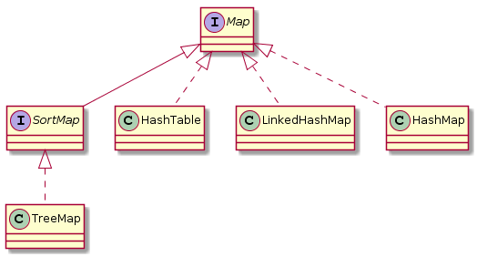

* `TreeMap`：基于红黑树实现。
* `HashMap`：基于哈希表实现，使用链表法解决冲突。
* `HashTable`：和 HashMap 类似，但它是线程安全的，这意味着同一时刻多个线程可以同时写入 HashTable 并且不会导致数据不一致。它是遗留类，不应该去使用它。现在可以使用 ConcurrentHashMap 来支持线程安全，并且 ConcurrentHashMap 的效率会更高，因为 ConcurrentHashMap 引入了分段锁。
* `LinkedHashMap`：使用双向链表来维护元素的顺序，顺序为插入顺序或者最近最少使用（LRU）顺序。
* `WeakHashMap`：主要用来实现缓存，通过使用 WeakHashMap 来引用缓存对象，由 JVM 对这部分缓存进行回收

### 17.2 对比分析
**1. Vector 和 ArrayList**
* Vector 是线程安全的，而 ArrayList 是非线程安全的；
* Vector 每次扩容请求其大小的 2 倍空间（也可以指定大小），而 ArrayList 是 1.5 倍。

**2. ArrayList 和 LinkedList**
* ArrayList 基于动态数组实现，LinkedList 基于双向链表实现；
* ArrayList 支持随机访问，LinkedList 不支持；
* LinkedList 在任意位置添加删除元素更快。

**3. HashMap 和 HashTable**
* HashTable 使用 synchronized 来进行同步。
* HashMap 可以插入键为 null 的 Entry。
* HashMap 的迭代器是 fail-fast 迭代器。
* HashMap 不能保证随着时间的推移 Map 中的元素次序是不变的。

### 17.3 JUC 容器
#### 17.3.1 CopyOnWriteArrayList
**读写分离**
写操作在一个复制的数组上进行，读操作还是在原始数组中进行，读写分离，互不影响。

写操作需要加锁，防止并发写入时导致写入数据丢失。

写操作结束之后需要把原始数组指向新的复制数组。

**适用场景**
CopyOnWriteArrayList 在写操作的同时允许读操作，大大提高了读操作的性能，因此很适合读多写少的应用场景。

但是 CopyOnWriteArrayList 有其缺陷：
* 内存占用：在写操作时需要复制一个新的数组，使得内存占用为原来的两倍左右；
* 数据不一致：读操作不能读取实时性的数据，因为部分写操作的数据还未同步到读数组中。

所以 CopyOnWriteArrayList 不适合内存敏感以及对实时性要求很高的场景。

#### 17.3.2 ConcurrentHashMap
ConcurrentHashMap 和 HashMap 实现上类似，最主要的差别是 ConcurrentHashMap 采用了分段锁（Segment），每个分段锁维护着几个桶（HashEntry），多个线程可以同时访问不同分段锁上的桶，从而使其并发度更高（并发度就是 Segment 的个数）。

Segment 继承自 ReentrantLock。

默认的并发级别为 16，也就是说默认创建 16 个 Segment。


## 八、注解
**1. 元注解: 专职负责注解其他的注解**
* `@Target`: 表示该注解可以用于什么地方，可用的ElementType参数包括：
    * `CONSTRUCTIOR`: 构造器的声明
    * `FIELD`: 域声明(包括enum实例)
    * `LOCAL_VARIABLE`: 局部变量声明
    * `METHOD`: 方法声明
    * `PACKAGE`: 包声明
    * `PARAMETER`: 参数声明
    * `TYPE`: 类、接口(包括注解类型)或enum声明
* `@Retention`: 表示需要在级别保存该注解类型，可选的RetetionPolicy参数包括：
    * `SOURCE`: 注解将被编译器丢弃
    * `CLASS`: 注解在class文件中可用，但会被VM丢弃
    * `RUNTIME`: VM将在运行期也保留注解，因此可以通过反射机制读取注解的信息

**2. 注解元素: 注解元素可用的类型如下**
* 所有的基本数据类型(int, float, boolean等)(不允许使用包装类)
* `String`
* `Class`
* `enum`
* `Annotation`
* 以上类型的数组

**3. 定义一个注解，并设置默认值**
```java
@Target(ElementType.METHOD)
@Retention(RetetionPolicy.RUNTIME)
public @interface @SimulatingNull{
    public int id() default -1;
    public String description() default "";
}
```

**4. 用法**
如果注解中仅有一个元素无默认值（需要赋值），此时无需使用名-值对的这种语法

**5. 示例**
```java
/**
 * 模拟JUnit实现单元测试
 */
@Target(ElementType.METHOD)
@Retention(RetentionPolicy.RUNTIME)
@interface Test {}

/**
 * @Test注解处理器
 */
class TestProcessor {
    public static void process(Class cl) {
        try {
            Object obj = cl.newInstance();
            for(Method method: cl.getDeclaredMethods()) {
                // System.out.println("--> "+method.getName());
                Annotation[] anns = method.getDeclaredAnnotations();
                if(anns.length < 1)
                    continue;
                if(anns[0] instanceof Test) {
                    System.out.println("==== [Testing]: " + method.getName() + " ====");
                    try {
                        method.invoke(obj);
                    } catch (java.lang.reflect.InvocationTargetException e) {
                        e.printStackTrace();
                    }
                }
            }

            System.out.println("==== you have passed this test. ====");
        } catch(InstantiationException|IllegalAccessException e) {
            e.printStackTrace();
        }
    }
}
class NeedTest {
    @Test
    public void run() {
        System.out.println("I'm running my Test...");
    }
}
public class Client {
    public static void main(String[] args) {
        TestProcessor.process(NeedTest.class);
    }
}
```

## 九、枚举
```java
public enum Type {
    
    FIRST("first"),
    SECOND("second");

    private String name;

    private Type(String name) {
        this.name = name;
    }
}
```

## 十、反射
* 获得`Class`对象的三种方式
    1. 实例化对象.getClass()
    2. 类名.class
    3. Class.forName("包名.类名")
* 创建实例: `new Instance()`
* 获取构造方法
* 获取普通方法
* 获取类的属性
* 获取类实现的接口
* 获取类的父类
* 获取包名
* 修改属性值
    * 对`public`类型的属性，获得`Field`后通过`set()`修改
    * 对`private`类型的属性，获得`Field`后先设置`setAccessible()`，再通过`set()`修改

## 十一、异常
Throwable 可以用来表示任何可以作为异常抛出的类，分为两种： Error 和 Exception。其中 Error 用来表示 JVM 无法处理的错误，Exception 分为两种：
* 受检异常 ：需要用 try...catch... 语句捕获并进行处理，并且可以从异常中恢复；
* 非受检异常 ：是程序运行时错误，例如除 0 会引发 Arithmetic Exception，此时程序崩溃并且无法恢复。


**1. 什么是Java异常**
异常是发生在程序执行过程中阻碍程序正常执行的错误事件。比如：用户输入错误数据、硬件故障、网络阻塞等都会导致出现异常。 只要在Java语句执行中产生了异常，一个异常对象就会被创建，JRE就会试图寻找异常处理程序来处理异常。如果有合适的异常处理程序，异常对象就会被异常处理程序接管，否则，将引发运行环境异常，JRE终止程序执行。 Java异常处理框架只能处理运行时错误，编译错误不在其考虑范围之内。

**2. Java异常处理中有哪些关键字？**
* **throw:** 有时我们需要显式地创建并抛出异常对象来终止程序的正常执行。throw关键字用来抛出并处理运行时异常。
* **throws:** 当我们抛出任何“被检查的异常(checked exception)”并不处理时，需要在方法签名中使用关键字throws来告知调用程序此方法可能会抛出的异常。调用方法可能会处理这些异常，或者同样用throws来将异常传给上一级调用方法。throws关键字后可接多个潜在异常，甚至是在main()中也可以使用throws。
* **try-catch:** 我们在代码中用try-catch块处理异常。当然，一个try块之后可以有多个catch子句，try-catch块也能嵌套。每个catch块必须接受一个（且仅有一个）代表异常类型的参数。
* **finally:** finally块是可选的，并且只能配合try-catch一起使用。虽然异常终止了程序的执行，但是还有一些打开的资源没有被关闭，因此，我们能使用finally进行关闭。不管异常有没有出现，finally块总会被执行。

**3. 描述一下异常的层级？**
Java异常是层级的，并通过继承来区分不同种类的异常。
* Throwable是所有异常的父类，它有两个直接子对象Error,Exception，其中Exception又被继续划分为“被检查的异常(checked exception)”和”运行时的异常（runtime exception,即不受检查的异常）”。 Error表示编译时和系统错误，通常不能预期和恢复，比如硬件故障、JVM崩溃、内存不足等。
* 被检查的异常（Checked exception）在程序中能预期，并要尝试修复，如FileNotFoundException。我们必须捕获此类异常，并为用户提供有用信息和合适日志来进行调试。Exception是所有被检查的异常的父类。
* 运行时异常（Runtime Exception）又称为不受检查异常，源于糟糕的编程。比如我们检索数组元素之前必须确认数组的长度，否则就可能会抛出ArrayIndexOutOfBoundException运行时异常。RuntimeException是所有运行时异常的父类。

**4. Java异常类有哪些的重要方法？**
Exception和它的所有子类没有提供任何特殊方法供使用，它们的所有方法都是来自其基类Throwable。
* `String getMessage()`：方法返回Throwable的String型信息，当异常通过构造器创建后可用。
* `String getLocalizedMessage()`：此方法通过被重写来得到用本地语言表示的异常信息返回给调用程序。Throwable类通常只是用getMessage()方法来实现返回异常信息。
* `synchronized Throwable getCause()`：此方法返回异常产生的原因，如果不知道原因的话返回null。(原文有拼写错误 应该是if 不是id)
* `String toString()`：方法返回String格式的Throwable信息，此信息包括Throwable的名字和本地化信息。
* `void printStackTrace()`：该方法打印栈轨迹信息到标准错误流。该方法能接受PrintStream 和PrintWriter作为参数实现重载，这样就能实现打印栈轨迹到文件或流中。

**5. 描述Java 7 ARM(Automatic Resource Management，自动资源管理)特征和多个catch块的使用**
如果一个try块中有多个异常要被捕获，catch块中的代码会变丑陋的同时还要用多余的代码来记录异常。有鉴于此，Java 7的一个新特征是：一个catch子句中可以捕获多个异常。示例代码如下：
```java
catch(IOException | SQLException | Exception e) {
    logger.error(e);
    throw new MyException(e.getMessage());
}
```

大多数情况下，当忘记关闭资源或因资源耗尽出现运行时异常时，我们只是用finally子句来关闭资源。这些异常很难调试，我们需要深入到资源使用的每一步来确定是否已关闭。因此，Java 7用try-with-resources进行了改进：在try子句中能创建一个资源对象，当程序的执行完try-catch之后，运行环境自动关闭资源。下面是这方面改进的示例代码：
```java
try (MyResource mr = new MyResource()) {
    System.out.println("MyResource created in try-with-resources");
} catch (Exception e) {
    e.printStackTrace();
}
```

扩展资料：
* [Java入门之异常处理](https://www.tianmaying.com/tutorial/Java-Exception)

## 十二、泛型

引入泛型的目的就是防止`ClassCastException`，即告诉编译器想使用什么类型，然后编译器帮你处理一切细节（即泛型在仅仅是在编译阶段起作用，编译器来做类型检查）。

使用通配符
* 无界`?`: 泛型类中参数为泛型的方法不可用了，可以使用返回值为泛型的方法（返回值类型为`Object`，所有类都是`Object`的子类）
* 子类`? extends Number`: 可以使用返回值为泛型的方法（返回值类型为`Number`），不可以使用参数为泛型的方法
* 父类`? super Number`: 可以使用参数为泛型的方法（参数类型为`Number`），不可以使用返回值为泛型的方法

**1. Java中的泛型是什么 ? 使用泛型的好处是什么?**
这是在各种Java泛型面试中，一开场你就会被问到的问题中的一个，主要集中在初级和中级面试中。那些拥有Java1.4或更早版本的开发背景的人都知道，在集合中存储对象并在使用前进行类型转换是多么的不方便。泛型防止了那种情况的发生。它提供了编译期的类型安全，确保你只能把正确类型的对象放入集合中，避免了在运行时出现ClassCastException。

**2. Java的泛型是如何工作的? 什么是类型擦除?**
这是一道更好的泛型面试题。泛型是通过类型擦除来实现的，编译器在编译时擦除了所有类型相关的信息，所以在运行时不存在任何类型相关的信息。例如List<String>在运行时仅用一个List来表示。这样做的目的，是确保能和Java 5之前的版本开发二进制类库进行兼容。你无法在运行时访问到类型参数，因为编译器已经把泛型类型转换成了原始类型。根据你对这个泛型问题的回答情况，你会得到一些后续提问，比如为什么泛型是由类型擦除来实现的或者给你展示一些会导致编译器出错的错误泛型代码。请阅读我的Java中泛型是如何工作的来了解更多信息。

**3. 什么是泛型中的限定通配符和非限定通配符?**
这是另一个非常流行的Java泛型面试题。限定通配符对类型进行了限制。有两种限定通配符，一种是<? extends T>它通过确保类型必须是T的子类来设定类型的上界，另一种是<? super T>它通过确保类型必须是T的父类来设定类型的下界。泛型类型必须用限定内的类型来进行初始化，否则会导致编译错误。另一方面<?>表示了非限定通配符，因为<?>可以用任意类型来替代。更多信息请参阅我的文章泛型中限定通配符和非限定通配符之间的区别。

**4. List<? extends T>和List <? super T>之间有什么区别 ?**
这和上一个面试题有联系，有时面试官会用这个问题来评估你对泛型的理解，而不是直接问你什么是限定通配符和非限定通配符。这两个List的声明都是限定通配符的例子，List<? extends T>可以接受任何继承自T的类型的List，而List<? super T>可以接受任何T的父类构成的List。例如List<? extends Number>可以接受List<Integer>或List<Float>。在本段出现的连接中可以找到更多信息。

**5. 如何编写一个泛型方法，让它能接受泛型参数并返回泛型类型?**
编写泛型方法并不困难，你需要用泛型类型来替代原始类型，比如使用T, E or K,V等被广泛认可的类型占位符。泛型方法的例子请参阅Java集合类框架。最简单的情况下，一个泛型方法可能会像这样:
```java
public V put(K key, V value) {
    return cache.put(key, value);
}
```

**6. Java中如何使用泛型编写带有参数的类?**
这是上一道面试题的延伸。面试官可能会要求你用泛型编写一个类型安全的类，而不是编写一个泛型方法。关键仍然是使用泛型类型来代替原始类型，而且要使用JDK中采用的标准占位符。

**7. 编写一段泛型程序来实现LRU缓存?**
对于喜欢Java编程的人来说这相当于是一次练习。给你个提示，LinkedHashMap可以用来实现固定大小的LRU缓存，当LRU缓存已经满了的时候，它会把最老的键值对移出缓存。LinkedHashMap提供了一个称为removeEldestEntry()的方法，该方法会被put()和putAll()调用来删除最老的键值对。当然，如果你已经编写了一个可运行的JUnit测试，你也可以随意编写你自己的实现代码。

**8. 你可以把List&lt;String&gt;传递给一个接受List&lt;Object&gt;参数的方法吗？**
对任何一个不太熟悉泛型的人来说，这个Java泛型题目看起来令人疑惑，因为乍看起来String是一种Object，所以List&lt;String&gt;应当可以用在需要List&lt;Object&gt;的地方，但是事实并非如此。真这样做的话会导致编译错误。如果你再深一步考虑，你会发现Java这样做是有意义的，因为List&lt;Object&gt;可以存储任何类型的对象包括String, Integer等等，而List&lt;String&gt;却只能用来存储Strings。　
```java
List<Object> objectList;
List<String> stringList;
objectList = stringList;  //compilation error incompatible types
```

**9. Array中可以用泛型吗?**
这可能是Java泛型面试题中最简单的一个了，当然前提是你要知道Array事实上并不支持泛型，这也是为什么Joshua Bloch在Effective Java一书中建议使用List来代替Array，因为List可以提供编译期的类型安全保证，而Array却不能。

**10. 如何阻止Java中的类型未检查的警告?**
如果你把泛型和原始类型混合起来使用，例如下列代码，Java 5的javac编译器会产生类型未检查的警告，例如
```java
List<String> rawList = new ArrayList()
```

## 十三、IO
### 13.1 概述
* Java 的 I/O 大概可以分成以下几类：
* 磁盘操作：File
* 字节操作：InputStream 和 OutputStream
* 字符操作：Reader 和 Writer
* 对象操作：Serializable
* 网络操作：Socket
* 新的输入/输出：NIO

### 13.2 磁盘操作
在Java中File类是定义在java.io包下面，是唯一一个与文件操作本身有关的类，所谓文件本身操作不包括内容（例如：文件创建，删除，重命名，获得信息：大小、修改时间），如果想要进行文件的操作，则首先必须给定操作文件的路径。

**File 的构造方法**
* `public File(String pathName);` // 给定文件的操作路径（重点）
* `public File(File parent , String child);` // 给定父路径以及子目录

**File 的常用方法**
* `public boolean createNewFile() throws IOException` // 创建一个新文件
* `public boolean exists()` // 判断文件是否存在
* `public boolean delete()` // 删除文件
* `public boolean canRead()` // 是否可读
* `public boolean canWrite()` // 是否可写
* `public long length()` // 文件大小(byte)
* `public long lastModified()` // 最后一次被修改的时间
* `public boolean isDirectory()` // 是否是一个目录
* `public boolean isFile()` // 是否是一个文件
* `public File[] listFiles()` // 对一个目录文件操作，获得其目录下直接包含的所有文件
* `public File getParentFile()` // 获取父目录文件
* `public String getParent()` // 获取父目录文件路径
* `public boolean mkdirs()` // 创建目录

**操作符问题**
* 一般情况下在程序开发中，在开发阶段都是在windows操作系统上进行的开发，而开发结束后，最终部署在Linux操作系统上或者Unix操作系统上来保证系统的安全性与稳定性，而Windows的分隔符 “\”  Linux上的分隔符 “/” 在这种情况下必须考虑程序的可移植性
* 如今Windows已支持 “/” 
* Java提供的自适应的分隔符: `public static final String separator`

### 13.3 字节操作
**输入流: InputStream (抽象类)**
* `public int read(byte[] b) throws IOException` // Reads some number of bytes from the input stream and stores them into the buffer array b. The number of bytes actually read is returned as an integer.
* `public int read(byte[] b, int off, int len) throws IOException` // Reads up to len bytes of data from the input stream into an array of bytes. An attempt is made to read as many as len bytes, but a smaller number may be read. The number of bytes actually read is returned as an integer.
* `public void close() throws IOException` // Closes this input stream and releases any system resources associated with the stream.

**输出流: OutputStream (抽象类)**
* `public abstract void write(int b) throws IOException;` // Writes the specified byte to this output stream. 
* `public void write(byte b[]) throws IOException` // Writes b.length bytes from the specified byte array to this output stream.
* `public void write(byte b[], int off, int len) throws IOException` // Writes len bytes from the specified byte array starting at offset off to this output stream.
* `public void flush() throws IOException` // Flushes this output stream and forces any buffered output bytes to be written out.
* `public void close() throws IOException` // Closes this output stream and releases any system resources associated with this stream.

### 13.4 字符操作
**输入流: Reader (抽象类)**
* `public int read() throws IOException` // 读取当个字符 读取完毕反回-1
* `public int read(char[] cbuf) throws IOException` // 根据字符数组进行读取 读取完毕反回-1
* `public abstract int read(char[] cbuf, int off, int len) throws IOException` // 给定字符数组，已经开始位置长度进行读取 读取完毕反回-1

**输出流: Writer (抽象类)**
* `public void write(String str) throws IOException`: // 字符的输出 可以直接输出Stirng类型（重点）
* `public void write(String str, int off, int len) throws IOException`: // 按照给定的长度输出部分字符串内容
* `public void write(char[] cbuf) throws IOException`: // 按照char数组的方式输出字符流
* `public abstract void write(char[] cbuf, int off, int len) throws IOException` // 按照char数据输出部分的字符

**编码与解码**
编码就是把字符转换为字节，而解码是把字节重新组合成字符。

如果编码和解码过程使用不同的编码方式那么就出现了乱码。

* GBK 编码中，中文字符占 2 个字节，英文字符占 1 个字节；
* UTF-8 编码中，中文字符占 3 个字节，英文字符占 1 个字节；
* UTF-16be 编码中，中文字符和英文字符都占 2 个字节。
* UTF-16be 中的 be 指的是 Big Endian，也就是大端。相应地也有 UTF-16le，le 指的是 Little Endian，也就是小端。

Java 使用双字节编码 UTF-16be，这不是指 Java 只支持这一种编码方式，而是说 char 这种类型使用 UTF-16be 进行编码。char 类型占 16 位，也就是两个字节，Java 使用这种双字节编码是为了让一个中文或者一个英文都能使用一个 char 来存储。

### 13.5 对象操作
**序列化**
序列化就是将一个对象转换成字节序列，方便存储和传输。

* 序列化：ObjectOutputStream.writeObject()
* 反序列化：ObjectInputStream.readObject()

不会对静态变量进行序列化，因为序列化只是保存对象的状态，静态变量属于类的状态。

**Serializable**
序列化的类需要实现 Serializable 接口，它只是一个标准，没有任何方法需要实现，但是如果不去实现它的话而进行序列化，会抛出异常。
```java
public static void main(String[] args) throws IOException, ClassNotFoundException {

    A a1 = new A(123, "abc");
    String objectFile = "file/a1";

    ObjectOutputStream objectOutputStream = new ObjectOutputStream(new FileOutputStream(objectFile));
    objectOutputStream.writeObject(a1);
    objectOutputStream.close();

    ObjectInputStream objectInputStream = new ObjectInputStream(new FileInputStream(objectFile));
    A a2 = (A) objectInputStream.readObject();
    objectInputStream.close();
    System.out.println(a2);
}

private static class A implements Serializable {

    private int x;
    private String y;

    A(int x, String y) {
        this.x = x;
        this.y = y;
    }

    @Override
    public String toString() {
        return "x = " + x + "  " + "y = " + y;
    }
}
```

**transient**
transient 关键字可以使一些属性不会被序列化。

ArrayList 中存储数据的数组 elementData 是用 transient 修饰的，因为这个数组是动态扩展的，并不是所有的空间都被使用，因此就不需要所有的内容都被序列化。通过重写序列化和反序列化方法，使得可以只序列化数组中有内容的那部分数据。
```java
private transient Object[] elementData;
```

### 13.6 NIO
新的输入/输出 (NIO) 库是在 JDK 1.4 中引入的，弥补了原来的 I/O 的不足，提供了高速的、面向块的 I/O。

NIO 与普通 I/O 的区别主要有以下两点：
* NIO 是非阻塞的；
* NIO 面向块，I/O 面向流。

#### 13.6.1 流与块
I/O 与 NIO 最重要的区别是数据打包和传输的方式，I/O 以流的方式处理数据，而 NIO 以块的方式处理数据。

面向流的 I/O 一次处理一个字节数据：一个输入流产生一个字节数据，一个输出流消费一个字节数据。为流式数据创建过滤器非常容易，链接几个过滤器，以便每个过滤器只负责复杂处理机制的一部分。不利的一面是，面向流的 I/O 通常相当慢。

面向块的 I/O 一次处理一个数据块，按块处理数据比按流处理数据要快得多。但是面向块的 I/O 缺少一些面向流的 I/O 所具有的优雅性和简单性。

I/O 包和 NIO 已经很好地集成了，java.io.* 已经以 NIO 为基础重新实现了，所以现在它可以利用 NIO 的一些特性。例如，java.io.* 包中的一些类包含以块的形式读写数据的方法，这使得即使在面向流的系统中，处理速度也会更快。

#### 13.6.2 通道与缓冲区
**1. 通道**
通道 Channel 是对原 I/O 包中的流的模拟，可以通过它读取和写入数据。

通道与流的不同之处在于，流只能在一个方向上移动(一个流必须是 InputStream 或者 OutputStream 的子类)，而通道是双向的，可以用于读、写或者同时用于读写。

通道包括以下类型：
* FileChannel：从文件中读写数据；
* DatagramChannel：通过 UDP 读写网络中数据；
* SocketChannel：通过 TCP 读写网络中数据；
* ServerSocketChannel：可以监听新进来的 TCP 连接，对每一个新进来的连接都会创建一个 SocketChannel。

**2. 缓冲区**
发送给一个通道的所有数据都必须首先放到缓冲区中，同样地，从通道中读取的任何数据都要先读到缓冲区中。也就是说，不会直接对通道进行读写数据，而是要先经过缓冲区。

缓冲区实质上是一个数组，但它不仅仅是一个数组。缓冲区提供了对数据的结构化访问，而且还可以跟踪系统的读/写进程。

缓冲区包括以下类型：
* ByteBuffer
* CharBuffer
* ShortBuffer
* IntBuffer
* LongBuffer
* FloatBuffer
* DoubleBuffer

#### 13.6.3 缓冲区状态变量
* capacity：最大容量；
* position：当前已经读写的字节数；
* limit：还可以读写的字节数。

状态变量的改变过程举例：

（1）新建一个大小为 8 个字节的缓冲区，此时 position 为 0，而 limit = capacity = 8。capacity 变量不会改变，下面的讨论会忽略它。
（2）从输入通道中读取 5 个字节数据写入缓冲区中，此时 position 为 5，limit 保持不变。
（3）在将缓冲区的数据写到输出通道之前，需要先调用 flip() 方法，这个方法将 limit 设置为当前 position，并将 position 设置为 0。
（4）从缓冲区中取 4 个字节到输出缓冲中，此时 position 设为 4。
（5）最后需要调用 clear() 方法来清空缓冲区，此时 position 和 limit 都被设置为最初位置。

#### 13.6.4 选择器
NIO 常常被叫做非阻塞 IO，主要是因为 NIO 在网络通信中的非阻塞特性被广泛使用。

NIO 实现了 IO 多路复用中的 Reactor 模型，一个线程 Thread 使用一个选择器 Selector 通过轮询的方式去监听多个通道 Channel 上的事件，从而让一个线程就可以处理多个事件。

通过配置监听的通道 Channel 为非阻塞，那么当 Channel 上的 IO 事件还未到达时，就不会进入阻塞状态一直等待，而是继续轮询其它 Channel，找到 IO 事件已经到达的 Channel 执行。

因为创建和切换线程的开销很大，因此使用一个线程来处理多个事件而不是一个线程处理一个事件，对于 IO 密集型的应用具有很好地性能。

应该注意的是，只有套接字 Channel 才能配置为非阻塞，而 FileChannel 不能，为 FileChannel 配置非阻塞也没有意义。

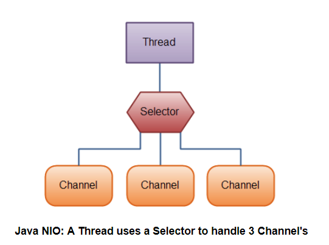

**1. 创建选择器**
```java
Selector selector = Selector.open();
```

**2. 将通道注册到选择器上**
```java
ServerSocketChannel ssChannel = ServerSocketChannel.open();
ssChannel.configureBlocking(false);
ssChannel.register(selector, SelectionKey.OP_ACCEPT);
```
通道必须配置为非阻塞模式，否则使用选择器就没有任何意义了，因为如果通道在某个事件上被阻塞，那么服务器就不能响应其它事件，必须等待这个事件处理完毕才能去处理其它事件，显然这和选择器的作用背道而驰。

在将通道注册到选择器上时，还需要指定要注册的具体事件，主要有以下几类：
* SelectionKey.OP_CONNECT
* SelectionKey.OP_ACCEPT
* SelectionKey.OP_READ
* SelectionKey.OP_WRITE

它们在 SelectionKey 的定义如下：
```java
public static final int OP_READ = 1 << 0;
public static final int OP_WRITE = 1 << 2;
public static final int OP_CONNECT = 1 << 3;
public static final int OP_ACCEPT = 1 << 4;
```
可以看出每个事件可以被当成一个位域，从而组成事件集整数。例如：
```java
int interestSet = SelectionKey.OP_READ | SelectionKey.OP_WRITE;
```

**3. 监听事件**
```java
int num = selector.select();
```
使用 select() 来监听到达的事件，它会一直阻塞直到有至少一个事件到达。

**4. 获取到达的事件**
```java
Set<SelectionKey> keys = selector.selectedKeys();
Iterator<SelectionKey> keyIterator = keys.iterator();
while (keyIterator.hasNext()) {
    SelectionKey key = keyIterator.next();
    if (key.isAcceptable()) {
        // ...
    } else if (key.isReadable()) {
        // ...
    }
    keyIterator.remove();
}
```

**5. 事件循环**
因为一次 select() 调用不能处理完所有的事件，并且服务器端有可能需要一直监听事件，因此服务器端处理事件的代码一般会放在一个死循环内。
```java
while (true) {
    int num = selector.select();
    Set<SelectionKey> keys = selector.selectedKeys();
    Iterator<SelectionKey> keyIterator = keys.iterator();
    while (keyIterator.hasNext()) {
        SelectionKey key = keyIterator.next();
        if (key.isAcceptable()) {
            // ...
        } else if (key.isReadable()) {
            // ...
        }
        keyIterator.remove();
    }
}
```

#### 13.6.5 内存映射文件
内存映射文件 I/O 是一种读和写文件数据的方法，它可以比常规的基于流或者基于通道的 I/O 快得多。

向内存映射文件写入可能是危险的，只是改变数组的单个元素这样的简单操作，就可能会直接修改磁盘上的文件。修改数据与将数据保存到磁盘是没有分开的。

下面代码行将文件的前 1024 个字节映射到内存中，map() 方法返回一个 MappedByteBuffer，它是 ByteBuffer 的子类。因此，可以像使用其他任何 ByteBuffer 一样使用新映射的缓冲区，操作系统会在需要时负责执行映射。
```java
MappedByteBuffer mbb = fc.map(FileChannel.MapMode.READ_WRITE, 0, 1024);
```

#### 13.6.6 文件 NIO 示例
复制文件
```java
public static void fastCopy(String src, String dist) throws IOException {

    /* 获得源文件的输入字节流 */
    FileInputStream fin = new FileInputStream(src);

    /* 获取输入字节流的文件通道 */
    FileChannel fcin = fin.getChannel();

    /* 获取目标文件的输出字节流 */
    FileOutputStream fout = new FileOutputStream(dist);

    /* 获取输出字节流的文件通道 */
    FileChannel fcout = fout.getChannel();

    /* 为缓冲区分配 1024 个字节 */
    ByteBuffer buffer = ByteBuffer.allocateDirect(1024);

    while (true) {

        /* 从输入通道中读取数据到缓冲区中 */
        int r = fcin.read(buffer);

        /* read() 返回 -1 表示 EOF */
        if (r == -1) {
            break;
        }

        /* 切换读写 */
        buffer.flip();

        /* 把缓冲区的内容写入输出文件中 */
        fcout.write(buffer);

        /* 清空缓冲区 */
        buffer.clear();
    }
}
```

#### 13.6.7 套接字 NIO 示例
```java
public class NIOServer {

    public static void main(String[] args) throws IOException {

        Selector selector = Selector.open();

        ServerSocketChannel ssChannel = ServerSocketChannel.open();
        ssChannel.configureBlocking(false);
        ssChannel.register(selector, SelectionKey.OP_ACCEPT);

        ServerSocket serverSocket = ssChannel.socket();
        InetSocketAddress address = new InetSocketAddress("127.0.0.1", 8888);
        serverSocket.bind(address);

        while (true) {

            selector.select();
            Set<SelectionKey> keys = selector.selectedKeys();
            Iterator<SelectionKey> keyIterator = keys.iterator();

            while (keyIterator.hasNext()) {

                SelectionKey key = keyIterator.next();

                if (key.isAcceptable()) {

                    ServerSocketChannel ssChannel1 = (ServerSocketChannel) key.channel();

                    // 服务器会为每个新连接创建一个 SocketChannel
                    SocketChannel sChannel = ssChannel1.accept();
                    sChannel.configureBlocking(false);

                    // 这个新连接主要用于从客户端读取数据
                    sChannel.register(selector, SelectionKey.OP_READ);

                } else if (key.isReadable()) {

                    SocketChannel sChannel = (SocketChannel) key.channel();
                    System.out.println(readDataFromSocketChannel(sChannel));
                    sChannel.close();
                }

                keyIterator.remove();
            }
        }
    }

    private static String readDataFromSocketChannel(SocketChannel sChannel) throws IOException {

        ByteBuffer buffer = ByteBuffer.allocate(1024);
        StringBuilder data = new StringBuilder();

        while (true) {

            buffer.clear();
            int n = sChannel.read(buffer);
            if (n == -1) {
                break;
            }
            buffer.flip();
            int limit = buffer.limit();
            char[] dst = new char[limit];
            for (int i = 0; i < limit; i++) {
                dst[i] = (char) buffer.get(i);
            }
            data.append(dst);
            buffer.clear();
        }
        return data.toString();
    }
}
```
```java
public class NIOClient {
    public static void main(String[] args) throws IOException {
        Socket socket = new Socket("127.0.0.1", 8888);
        OutputStream out = socket.getOutputStream();
        String s = "hello world";
        out.write(s.getBytes());
        out.close();
    }
}
```

## 十四、网络
### 14.1 概述

Java 中的网络支持：

* InetAddress：用于表示网络上的硬件资源，即 IP 地址；
* URL：统一资源定位符；
* Sockets：使用 TCP 协议实现网络通信；
* Datagram：使用 UDP 协议实现网络通信。

### 14.2 InetAddress
没有公有的构造函数，只能通过静态方法来创建实例。
```java
InetAddress.getByName(String host);
InetAddress.getByAddress(byte[] address);
```

### 14.3 URL
可以直接从 URL 中读取字节流数据。
```java
public static void main(String[] args) throws IOException {

    URL url = new URL("http://www.baidu.com");

    /* 字节流 */
    InputStream is = url.openStream();

    /* 字符流 */
    InputStreamReader isr = new InputStreamReader(is, "utf-8");

    /* 提供缓存功能 */
    BufferedReader br = new BufferedReader(isr);

    String line;
    while ((line = br.readLine()) != null) {
        System.out.println(line);
    }

    br.close();
}
```

### 14.4 Sockets
* ServerSocket：服务器端类
* Socket：客户端类
* 服务器和客户端通过 InputStream 和 OutputStream 进行输入输出。

### 14.5 Datagram
* DatagramSocket：通信类
* DatagramPacket：数据包类

### 14.6 TCP & UDP
**TCP 提供可靠的连接（保证接收方确认接收消息）**
* 服务端
    * 定义：`public class ServerSocket extends Object implements Closeable`
    * 构造方法：`public ServerSocket(int port) throws IOException`
    * 监听连接：`public Socket accept() throws IOException`
* 客户端
    * 定义：`public class Socket extends Object implements Closeable`
    * 构造方法：`public Socket(InetAddress address, int port) throws IOException`
    * 获取输出流：`public OutputStream getOutputStream() throws IOException`
    * 获取输入流：`public InputStream getInputStream() throws IOException`

**UDP提供不可靠的连接（只保证消息发出，不确定接收方是否正确接收）**
* 在Java使用过程中，不需要建立连接，只需要给数据报指定其目的地址，将其发出即可。
* 方法与定义
    * 定义数据报：`public final class DatagramPacket extends Object`
    * 构造数据报：`public DatagramPacket(byte[] buf, int length)`
    * 构造数据报：`DatagramPacket(byte[] buf, int offset, int length, InetAddress address, int port)`
    * 网络定义：`public class DatagramSocket extends Object implements Closeable`
    * 构造网络（指定本地监听端口）：`public DatagramSocket(int port) throws SocketException`
    * 接收数据报：`public void receive(DatagramPacket p) throws IOException`
    * 发送数据报：`public void send(DatagramPacket p) throws IOException`

## 十六、并发
### 16.1 线程状态转换

JDK，Thread中 `enum State`声明了6中线程状态。


**新建（New）**
创建后尚未启动。

**可运行（Runnable）**
可能正在运行，也可能正在等待 CPU 时间片。

包含了操作系统线程状态中的 Running 和 Ready。

**阻塞（Blocking）**
等待获取一个排它锁，如果其线程释放了锁就会结束此状态。

**无限期等待（Waiting）**
等待其它线程显式地唤醒，否则不会被分配 CPU 时间片。

|进入方法|退出方法|
|-|-|
|没有设置 Timeout 参数的 Object.wait() 方法|Object.notify() / Object.notifyAll()|
|没有设置 Timeout 参数的 Thread.join() 方法|被调用的线程执行完毕|
|LockSupport.park() 方法|-|

**限期等待（Timed Waiting）**
无需等待其它线程显式地唤醒，在一定时间之后会被系统自动唤醒。

调用 Thread.sleep() 方法使线程进入限期等待状态时，常常用“使一个线程睡眠”进行描述。

调用 Object.wait() 方法使线程进入限期等待或者无限期等待时，常常用“挂起一个线程”进行描述。

睡眠和挂起是用来描述行为，而阻塞和等待用来描述状态。

阻塞和等待的区别在于，阻塞是被动的，它是在等待获取一个排它锁。而等待是主动的，通过调用 Thread.sleep() 和 Object.wait() 等方法进入。

|进入方法|退出方法|
|:-|:-|
|Thread.sleep() 方法|时间结束|
|设置了 Timeout 参数的 Object.wait() 方法|时间结束 / Object.notify() / Object.notifyAll()|
|设置了 Timeout 参数的 Thread.join() 方法|时间结束 / 被调用的线程执行完毕|
|LockSupport.parkNanos() 方法|-|
|LockSupport.parkUntil() 方法|-|

**死亡（Terminated）**
可以是线程结束任务之后自己结束，或者产生了异常而结束。

### 16.2 使用线程
有三种使用线程的方法：
* 实现 Runnable 接口
* 实现 Callable 接口
* 继承 Thread 类

实现 Runnable 和 Callable 接口的类只能当做一个可以在线程中运行的任务，不是真正意义上的线程，因此最后还需要通过 Thread 来调用。可以说任务是通过线程驱动从而执行的。

实现接口会更好一些，因为：
* Java 不支持多重继承，因此继承了 Thread 类就无法继承其它类，但是可以实现多个接口；
* 类可能只要求可执行就行，继承整个 Thread 类开销过大。

### 16.3 基础线程机制

#### 16.3.1 Executor

Executor 管理多个异步任务的执行，而无需程序员显式地管理线程的生命周期。这里的异步是指多个任务的执行互不干扰，不需要进行同步操作。

主要有三种 Executor：

- CachedThreadPool：一个任务创建一个线程；
- FixedThreadPool：所有任务只能使用固定大小的线程；
- SingleThreadExecutor：相当于大小为 1 的 FixedThreadPool。

```java
public static void main(String[] args) {
    ExecutorService executorService = Executors.newCachedThreadPool();
    for (int i = 0; i < 5; i++) {
        executorService.execute(new MyRunnable());
    }
    executorService.shutdown();
}
```

#### 16.3.2 Daemon

守护线程是程序运行时在后台提供服务的线程，不属于程序中不可或缺的部分。

当所有非守护线程结束时，程序也就终止，同时会杀死所有守护线程。

main() 属于非守护线程。

使用 setDaemon() 方法将一个线程设置为守护线程。

```java
public static void main(String[] args) {
    Thread thread = new Thread(new MyRunnable());
    thread.setDaemon(true);
}
```

#### 16.3.3 sleep()

Thread.sleep(millisec) 方法会休眠当前正在执行的线程，millisec 单位为毫秒。

sleep() 可能会抛出 InterruptedException，因为异常不能跨线程传播回 main() 中，因此必须在本地进行处理。线程中抛出的其它异常也同样需要在本地进行处理。

```java
public void run() {
    try {
        Thread.sleep(3000);
    } catch (InterruptedException e) {
        e.printStackTrace();
    }
}
```

#### 16.3.4 yield()

对静态方法 Thread.yield() 的调用声明了当前线程已经完成了生命周期中最重要的部分，可以切换给其它线程来执行。该方法只是对线程调度器的一个建议，而且也只是建议具有相同优先级的其它线程可以运行。

```java
public void run() {
    Thread.yield();
}
```

### 16.4 中断

一个线程执行完毕之后会自动结束，如果在运行过程中发生异常也会提前结束。

#### 16.4.1 InterruptedException

通过调用一个线程的 interrupt() 来中断该线程，如果该线程处于阻塞、限期等待或者无限期等待状态，那么就会抛出 InterruptedException，从而提前结束该线程。但是不能中断 I/O 阻塞和 synchronized 锁阻塞。

对于以下代码，在 main() 中启动一个线程之后再中断它，由于线程中调用了 Thread.sleep() 方法，因此会抛出一个 InterruptedException，从而提前结束线程，不执行之后的语句。

```java
public class InterruptExample {

    private static class MyThread1 extends Thread {
        @Override
        public void run() {
            try {
                Thread.sleep(2000);
                System.out.println("Thread run");
            } catch (InterruptedException e) {
                e.printStackTrace();
            }
        }
    }
}
```

```java
public static void main(String[] args) throws InterruptedException {
    Thread thread1 = new MyThread1();
    thread1.start();
    thread1.interrupt();
    System.out.println("Main run");
}
```

```html
Main run
java.lang.InterruptedException: sleep interrupted
    at java.lang.Thread.sleep(Native Method)
    at InterruptExample.lambda$main$0(InterruptExample.java:5)
    at InterruptExample$$Lambda$1/713338599.run(Unknown Source)
    at java.lang.Thread.run(Thread.java:745)
```

#### 16.4.2 interrupted()

如果一个线程的 run() 方法执行一个无限循环，并且没有执行 sleep() 等会抛出 InterruptedException 的操作，那么调用线程的 interrupt() 方法就无法使线程提前结束。

但是调用 interrupt() 方法会设置线程的中断标记，此时调用 interrupted() 方法会返回 true。因此可以在循环体中使用 interrupted() 方法来判断线程是否处于中断状态，从而提前结束线程。

```java
public class InterruptExample {

    private static class MyThread2 extends Thread {
        @Override
        public void run() {
            while (!interrupted()) {
                // ..
            }
            System.out.println("Thread end");
        }
    }
}
```

```java
public static void main(String[] args) throws InterruptedException {
    Thread thread2 = new MyThread2();
    thread2.start();
    thread2.interrupt();
}
```

```html
Thread end
```

#### 16.4.3 Executor 的中断操作

调用 Executor 的 shutdown() 方法会等待线程都执行完毕之后再关闭，但是如果调用的是 shutdownNow() 方法，则相当于调用每个线程的 interrupt() 方法。

以下使用 Lambda 创建线程，相当于创建了一个匿名内部线程。

```java
public static void main(String[] args) {
    ExecutorService executorService = Executors.newCachedThreadPool();
    executorService.execute(() -> {
        try {
            Thread.sleep(2000);
            System.out.println("Thread run");
        } catch (InterruptedException e) {
            e.printStackTrace();
        }
    });
    executorService.shutdownNow();
    System.out.println("Main run");
}
```

```html
Main run
java.lang.InterruptedException: sleep interrupted
    at java.lang.Thread.sleep(Native Method)
    at ExecutorInterruptExample.lambda$main$0(ExecutorInterruptExample.java:9)
    at ExecutorInterruptExample$$Lambda$1/1160460865.run(Unknown Source)
    at java.util.concurrent.ThreadPoolExecutor.runWorker(ThreadPoolExecutor.java:1142)
    at java.util.concurrent.ThreadPoolExecutor$Worker.run(ThreadPoolExecutor.java:617)
    at java.lang.Thread.run(Thread.java:745)
```

如果只想中断 Executor 中的一个线程，可以通过使用 submit() 方法来提交一个线程，它会返回一个 Future<?> 对象，通过调用该对象的 cancel(true) 方法就可以中断线程。

```java
Future<?> future = executorService.submit(() -> {
    // ..
});
future.cancel(true);
```

### 16.5 互斥同步

Java 提供了两种锁机制来控制多个线程对共享资源的互斥访问，第一个是 JVM 实现的 synchronized，而另一个是 JDK 实现的 ReentrantLock。

#### 16.5.1 synchronized

**1. 同步一个代码块** 

```java
public void func() {
    synchronized (this) {
        // ...
    }
}
```

它只作用于同一个对象，如果调用两个对象上的同步代码块，就不会进行同步。

对于以下代码，使用 ExecutorService 执行了两个线程，由于调用的是同一个对象的同步代码块，因此这两个线程会进行同步，当一个线程进入同步语句块时，另一个线程就必须等待。

```java
public class SynchronizedExample {

    public void func1() {
        synchronized (this) {
            for (int i = 0; i < 10; i++) {
                System.out.print(i + " ");
            }
        }
    }
}
```

```java
public static void main(String[] args) {
    SynchronizedExample e1 = new SynchronizedExample();
    ExecutorService executorService = Executors.newCachedThreadPool();
    executorService.execute(() -> e1.func1());
    executorService.execute(() -> e1.func1());
}
```

```html
0 1 2 3 4 5 6 7 8 9 0 1 2 3 4 5 6 7 8 9
```

对于以下代码，两个线程调用了不同对象的同步代码块，因此这两个线程就不需要同步。从输出结果可以看出，两个线程交叉执行。

```java
public static void main(String[] args) {
    SynchronizedExample e1 = new SynchronizedExample();
    SynchronizedExample e2 = new SynchronizedExample();
    ExecutorService executorService = Executors.newCachedThreadPool();
    executorService.execute(() -> e1.func1());
    executorService.execute(() -> e2.func1());
}
```

```html
0 0 1 1 2 2 3 3 4 4 5 5 6 6 7 7 8 8 9 9
```


**2. 同步一个方法** 

```java
public synchronized void func () {
    // ...
}
```

它和同步代码块一样，作用于同一个对象。

**3. 同步一个类** 

```java
public void func() {
    synchronized (SynchronizedExample.class) {
        // ...
    }
}
```

作用于整个类，也就是说两个线程调用同一个类的不同对象上的这种同步语句，也会进行同步。

```java
public class SynchronizedExample {

    public void func2() {
        synchronized (SynchronizedExample.class) {
            for (int i = 0; i < 10; i++) {
                System.out.print(i + " ");
            }
        }
    }
}
```

```java
public static void main(String[] args) {
    SynchronizedExample e1 = new SynchronizedExample();
    SynchronizedExample e2 = new SynchronizedExample();
    ExecutorService executorService = Executors.newCachedThreadPool();
    executorService.execute(() -> e1.func2());
    executorService.execute(() -> e2.func2());
}
```

```html
0 1 2 3 4 5 6 7 8 9 0 1 2 3 4 5 6 7 8 9
```

**4. 同步一个静态方法** 

```java
public synchronized static void fun() {
    // ...
}
```

作用于整个类。

#### 16.5.2 ReentrantLock

ReentrantLock 是 java.util.concurrent（J.U.C）包中的锁。

```java
public class LockExample {

    private Lock lock = new ReentrantLock();

    public void func() {
        lock.lock();
        try {
            for (int i = 0; i < 10; i++) {
                System.out.print(i + " ");
            }
        } finally {
            lock.unlock(); // 确保释放锁，从而避免发生死锁。
        }
    }
}
```

```java
public static void main(String[] args) {
    LockExample lockExample = new LockExample();
    ExecutorService executorService = Executors.newCachedThreadPool();
    executorService.execute(() -> lockExample.func());
    executorService.execute(() -> lockExample.func());
}
```

```html
0 1 2 3 4 5 6 7 8 9 0 1 2 3 4 5 6 7 8 9
```


#### 16.5.3 比较

**1. 锁的实现** 

synchronized 是 JVM 实现的，而 ReentrantLock 是 JDK 实现的。

**2. 性能** 

新版本 Java 对 synchronized 进行了很多优化，例如自旋锁等，synchronized 与 ReentrantLock 大致相同。

**3. 等待可中断** 

当持有锁的线程长期不释放锁的时候，正在等待的线程可以选择放弃等待，改为处理其他事情。

ReentrantLock 可中断，而 synchronized 不行。

**4. 公平锁** 

公平锁是指多个线程在等待同一个锁时，必须按照申请锁的时间顺序来依次获得锁。

synchronized 中的锁是非公平的，ReentrantLock 默认情况下也是非公平的，但是也可以是公平的。

**5. 锁绑定多个条件** 

一个 ReentrantLock 可以同时绑定多个 Condition 对象。

#### 16.5.4 使用选择

除非需要使用 ReentrantLock 的高级功能，否则优先使用 synchronized。这是因为 synchronized 是 JVM 实现的一种锁机制，JVM 原生地支持它，而 ReentrantLock 不是所有的 JDK 版本都支持。并且使用 synchronized 不用担心没有释放锁而导致死锁问题，因为 JVM 会确保锁的释放。

### 16.6 线程之间的协作

当多个线程可以一起工作去解决某个问题时，如果某些部分必须在其它部分之前完成，那么就需要对线程进行协调。

#### 16.6.1 join()

在线程中调用另一个线程的 join() 方法，会将当前线程挂起，而不是忙等待，直到目标线程结束。

对于以下代码，虽然 b 线程先启动，但是因为在 b 线程中调用了 a 线程的 join() 方法，b 线程会等待 a 线程结束才继续执行，因此最后能够保证 a 线程的输出先于 b 线程的输出。

```java
public class JoinExample {

    private class A extends Thread {
        @Override
        public void run() {
            System.out.println("A");
        }
    }

    private class B extends Thread {

        private A a;

        B(A a) {
            this.a = a;
        }

        @Override
        public void run() {
            try {
                a.join();
            } catch (InterruptedException e) {
                e.printStackTrace();
            }
            System.out.println("B");
        }
    }

    public void test() {
        A a = new A();
        B b = new B(a);
        b.start();
        a.start();
    }
}
```

```java
public static void main(String[] args) {
    JoinExample example = new JoinExample();
    example.test();
}
```

```
A
B
```

#### 16.6.2 wait() notify() notifyAll()

调用 wait() 使得线程等待某个条件满足，线程在等待时会被挂起，当其他线程的运行使得这个条件满足时，其它线程会调用 notify() 或者 notifyAll() 来唤醒挂起的线程。

它们都属于 Object 的一部分，而不属于 Thread。

只能用在同步方法或者同步控制块中使用，否则会在运行时抛出 IllegalMonitorStateExeception。

使用 wait() 挂起期间，线程会释放锁。这是因为，如果没有释放锁，那么其它线程就无法进入对象的同步方法或者同步控制块中，那么就无法执行 notify() 或者 notifyAll() 来唤醒挂起的线程，造成死锁。

```java
public class WaitNotifyExample {

    public synchronized void before() {
        System.out.println("before");
        notifyAll();
    }

    public synchronized void after() {
        try {
            wait();
        } catch (InterruptedException e) {
            e.printStackTrace();
        }
        System.out.println("after");
    }
}
```

```java
public static void main(String[] args) {
    ExecutorService executorService = Executors.newCachedThreadPool();
    WaitNotifyExample example = new WaitNotifyExample();
    executorService.execute(() -> example.after());
    executorService.execute(() -> example.before());
}
```

```html
before
after
```

**wait() 和 sleep() 的区别** 

- wait() 是 Object 的方法，而 sleep() 是 Thread 的静态方法；
- wait() 会释放锁，sleep() 不会。

#### 16.6.3 await() signal() signalAll()

java.util.concurrent 类库中提供了 Condition 类来实现线程之间的协调，可以在 Condition 上调用 await() 方法使线程等待，其它线程调用 signal() 或 signalAll() 方法唤醒等待的线程。

相比于 wait() 这种等待方式，await() 可以指定等待的条件，因此更加灵活。

使用 Lock 来获取一个 Condition 对象。

```java
public class AwaitSignalExample {

    private Lock lock = new ReentrantLock();
    private Condition condition = lock.newCondition();

    public void before() {
        lock.lock();
        try {
            System.out.println("before");
            condition.signalAll();
        } finally {
            lock.unlock();
        }
    }

    public void after() {
        lock.lock();
        try {
            condition.await();
            System.out.println("after");
        } catch (InterruptedException e) {
            e.printStackTrace();
        } finally {
            lock.unlock();
        }
    }
}
```

```java
public static void main(String[] args) {
    ExecutorService executorService = Executors.newCachedThreadPool();
    AwaitSignalExample example = new AwaitSignalExample();
    executorService.execute(() -> example.after());
    executorService.execute(() -> example.before());
}
```

```html
before
after
```

### 16.7 J.U.C - AQS

java.util.concurrent（J.U.C）大大提高了并发性能，AQS 被认为是 J.U.C 的核心。

#### 16.7.1 CountdownLatch

用来控制一个线程等待多个线程。

维护了一个计数器 cnt，每次调用 countDown() 方法会让计数器的值减 1，减到 0 的时候，那些因为调用 await() 方法而在等待的线程就会被唤醒。


```java
public class CountdownLatchExample {

    public static void main(String[] args) throws InterruptedException {
        final int totalThread = 10;
        CountDownLatch countDownLatch = new CountDownLatch(totalThread);
        ExecutorService executorService = Executors.newCachedThreadPool();
        for (int i = 0; i < totalThread; i++) {
            executorService.execute(() -> {
                System.out.print("run..");
                countDownLatch.countDown();
            });
        }
        countDownLatch.await();
        System.out.println("end");
        executorService.shutdown();
    }
}
```

```html
run..run..run..run..run..run..run..run..run..run..end
```

#### 16.7.2 CyclicBarrier

用来控制多个线程互相等待，只有当多个线程都到达时，这些线程才会继续执行。

和 CountdownLatch 相似，都是通过维护计数器来实现的。线程执行 await() 方法之后计数器会减 1，并进行等待，直到计数器为 0，所有调用 awati() 方法而在等待的线程才能继续执行。

CyclicBarrier 和 CountdownLatch 的一个区别是，CyclicBarrier 的计数器通过调用 reset() 方法可以循环使用，所以它才叫做循环屏障。

CyclicBarrier 有两个构造函数，其中 parties 指示计数器的初始值，barrierAction 在所有线程都到达屏障的时候会执行一次。

```java
public CyclicBarrier(int parties, Runnable barrierAction) {
    if (parties <= 0) throw new IllegalArgumentException();
    this.parties = parties;
    this.count = parties;
    this.barrierCommand = barrierAction;
}

public CyclicBarrier(int parties) {
    this(parties, null);
}
```

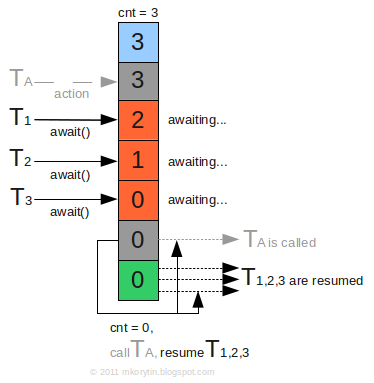

```java
public class CyclicBarrierExample {

    public static void main(String[] args) {
        final int totalThread = 10;
        CyclicBarrier cyclicBarrier = new CyclicBarrier(totalThread);
        ExecutorService executorService = Executors.newCachedThreadPool();
        for (int i = 0; i < totalThread; i++) {
            executorService.execute(() -> {
                System.out.print("before..");
                try {
                    cyclicBarrier.await();
                } catch (InterruptedException | BrokenBarrierException e) {
                    e.printStackTrace();
                }
                System.out.print("after..");
            });
        }
        executorService.shutdown();
    }
}
```

```html
before..before..before..before..before..before..before..before..before..before..after..after..after..after..after..after..after..after..after..after..
```

#### 16.7.3 Semaphore

Semaphore 类似于操作系统中的信号量，可以控制对互斥资源的访问线程数。

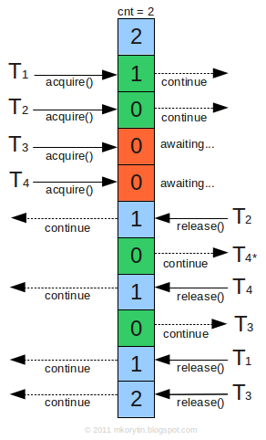

以下代码模拟了对某个服务的并发请求，每次只能有 3 个客户端同时访问，请求总数为 10。

```java
public class SemaphoreExample {

    public static void main(String[] args) {
        final int clientCount = 3;
        final int totalRequestCount = 10;
        Semaphore semaphore = new Semaphore(clientCount);
        ExecutorService executorService = Executors.newCachedThreadPool();
        for (int i = 0; i < totalRequestCount; i++) {
            executorService.execute(()->{
                try {
                    semaphore.acquire();
                    System.out.print(semaphore.availablePermits() + " ");
                } catch (InterruptedException e) {
                    e.printStackTrace();
                } finally {
                    semaphore.release();
                }
            });
        }
        executorService.shutdown();
    }
}
```

```html
2 1 2 2 2 2 2 1 2 2
```

### 16.8 J.U.C - 其它组件

#### 16.8.1 FutureTask

在介绍 Callable 时我们知道它可以有返回值，返回值通过 Future<V> 进行封装。FutureTask 实现了 RunnableFuture 接口，该接口继承自 Runnable 和 Future<V> 接口，这使得 FutureTask 既可以当做一个任务执行，也可以有返回值。

```java
public class FutureTask<V> implements RunnableFuture<V>
```

```java
public interface RunnableFuture<V> extends Runnable, Future<V>
```

FutureTask 可用于异步获取执行结果或取消执行任务的场景。当一个计算任务需要执行很长时间，那么就可以用 FutureTask 来封装这个任务，主线程在完成自己的任务之后再去获取结果。

```java
public class FutureTaskExample {

    public static void main(String[] args) throws ExecutionException, InterruptedException {
        FutureTask<Integer> futureTask = new FutureTask<Integer>(new Callable<Integer>() {
            @Override
            public Integer call() throws Exception {
                int result = 0;
                for (int i = 0; i < 100; i++) {
                    Thread.sleep(10);
                    result += i;
                }
                return result;
            }
        });

        Thread computeThread = new Thread(futureTask);
        computeThread.start();

        Thread otherThread = new Thread(() -> {
            System.out.println("other task is running...");
            try {
                Thread.sleep(1000);
            } catch (InterruptedException e) {
                e.printStackTrace();
            }
        });
        otherThread.start();
        System.out.println(futureTask.get());
    }
}
```

```html
other task is running...
4950
```

#### 16.8.2 BlockingQueue

java.util.concurrent.BlockingQueue 接口有以下阻塞队列的实现：

-  **FIFO 队列** ：LinkedBlockingQueue、ArrayBlockingQueue（固定长度）
-  **优先级队列** ：PriorityBlockingQueue

提供了阻塞的 take() 和 put() 方法：如果队列为空 take() 将阻塞，直到队列中有内容；如果队列为满 put() 将阻塞，直到队列有空闲位置。

**使用 BlockingQueue 实现生产者消费者问题** 

```java
public class ProducerConsumer {

    private static BlockingQueue<String> queue = new ArrayBlockingQueue<>(5);

    private static class Producer extends Thread {
        @Override
        public void run() {
            try {
                queue.put("product");
            } catch (InterruptedException e) {
                e.printStackTrace();
            }
            System.out.print("produce..");
        }
    }

    private static class Consumer extends Thread {

        @Override
        public void run() {
            try {
                String product = queue.take();
            } catch (InterruptedException e) {
                e.printStackTrace();
            }
            System.out.print("consume..");
        }
    }
}
```

```java
public static void main(String[] args) {
    for (int i = 0; i < 2; i++) {
        Producer producer = new Producer();
        producer.start();
    }
    for (int i = 0; i < 5; i++) {
        Consumer consumer = new Consumer();
        consumer.start();
    }
    for (int i = 0; i < 3; i++) {
        Producer producer = new Producer();
        producer.start();
    }
}
```

```html
produce..produce..consume..consume..produce..consume..produce..consume..produce..consume..
```

#### 16.8.3 ForkJoin

主要用于并行计算中，和 MapReduce 原理类似，都是把大的计算任务拆分成多个小任务并行计算。

```java
public class ForkJoinExample extends RecursiveTask<Integer> {

    private final int threshold = 5;
    private int first;
    private int last;

    public ForkJoinExample(int first, int last) {
        this.first = first;
        this.last = last;
    }

    @Override
    protected Integer compute() {
        int result = 0;
        if (last - first <= threshold) {
            // 任务足够小则直接计算
            for (int i = first; i <= last; i++) {
                result += i;
            }
        } else {
            // 拆分成小任务
            int middle = first + (last - first) / 2;
            ForkJoinExample leftTask = new ForkJoinExample(first, middle);
            ForkJoinExample rightTask = new ForkJoinExample(middle + 1, last);
            leftTask.fork();
            rightTask.fork();
            result = leftTask.join() + rightTask.join();
        }
        return result;
    }
}
```

```java
public static void main(String[] args) throws ExecutionException, InterruptedException {
    ForkJoinExample example = new ForkJoinExample(1, 10000);
    ForkJoinPool forkJoinPool = new ForkJoinPool();
    Future result = forkJoinPool.submit(example);
    System.out.println(result.get());
}
```

ForkJoin 使用 ForkJoinPool 来启动，它是一个特殊的线程池，线程数量取决于 CPU 核数。

```java
public class ForkJoinPool extends AbstractExecutorService
```

ForkJoinPool 实现了工作窃取算法来提高 CPU 的利用率。每个线程都维护了一个双端队列，用来存储需要执行的任务。工作窃取算法允许空闲的线程从其它线程的双端队列中窃取一个任务来执行。窃取的任务必须是最晚的任务，避免和队列所属线程发生竞争。例如下图中，Thread2 从 Thread1 的队列中拿出最晚的 Task1 任务，Thread1 会拿出 Task2 来执行，这样就避免发生竞争。但是如果队列中只有一个任务时还是会发生竞争。

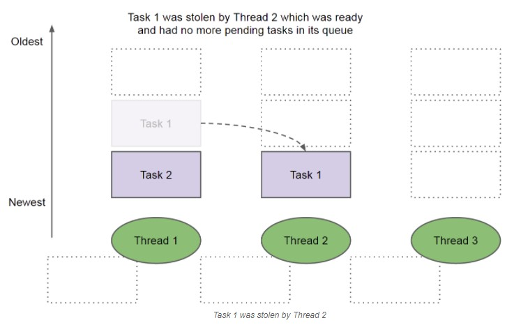

### 16.9 线程不安全示例

如果多个线程对同一个共享数据进行访问而不采取同步操作的话，那么操作的结果是不一致的。

以下代码演示了 1000 个线程同时对 cnt 执行自增操作，操作结束之后它的值有可能小于 1000。

```java
public class ThreadUnsafeExample {

    private int cnt = 0;

    public void add() {
        cnt++;
    }

    public int get() {
        return cnt;
    }
}
```

```java
public static void main(String[] args) throws InterruptedException {
    final int threadSize = 1000;
    ThreadUnsafeExample example = new ThreadUnsafeExample();
    final CountDownLatch countDownLatch = new CountDownLatch(threadSize);
    ExecutorService executorService = Executors.newCachedThreadPool();
    for (int i = 0; i < threadSize; i++) {
        executorService.execute(() -> {
            example.add();
            countDownLatch.countDown();
        });
    }
    countDownLatch.await();
    executorService.shutdown();
    System.out.println(example.get());
}
```

```html
997
```

### 16.10 Java 内存模型

Java 内存模型试图屏蔽各种硬件和操作系统的内存访问差异，以实现让 Java 程序在各种平台下都能达到一致的内存访问效果。

#### 16.10.1 主内存与工作内存

处理器上的寄存器的读写的速度比内存快几个数量级，为了解决这种速度矛盾，在它们之间加入了高速缓存。

加入高速缓存带来了一个新的问题：缓存一致性。如果多个缓存共享同一块主内存区域，那么多个缓存的数据可能会不一致，需要一些协议来解决这个问题。


所有的变量都存储在主内存中，每个线程还有自己的工作内存，工作内存存储在高速缓存或者寄存器中，保存了该线程使用的变量的主内存副本拷贝。

线程只能直接操作工作内存中的变量，不同线程之间的变量值传递需要通过主内存来完成。


#### 16.10.2 内存间交互操作

Java 内存模型定义了 8 个操作来完成主内存和工作内存的交互操作。


- read：把一个变量的值从主内存传输到工作内存中
- load：在 read 之后执行，把 read 得到的值放入工作内存的变量副本中
- use：把工作内存中一个变量的值传递给执行引擎
- assign：把一个从执行引擎接收到的值赋给工作内存的变量
- store：把工作内存的一个变量的值传送到主内存中
- write：在 store 之后执行，把 store 得到的值放入主内存的变量中
- lock：作用于主内存的变量
- unlock

#### 16.10.3 内存模型三大特性

**1. 原子性**

Java 内存模型保证了 read、load、use、assign、store、write、lock 和 unlock 操作具有原子性，例如对一个 int 类型的变量执行 assign 赋值操作，这个操作就是原子性的。但是 Java 内存模型允许虚拟机将没有被 volatile 修饰的 64 位数据（long，double）的读写操作划分为两次 32 位的操作来进行，即 load、store、read 和 write 操作可以不具备原子性。

有一个错误认识就是，int 等原子性的类型在多线程环境中不会出现线程安全问题。前面的线程不安全示例代码中，cnt 属于 int 类型变量，1000 个线程对它进行自增操作之后，得到的值为 997 而不是 1000。

为了方便讨论，将内存间的交互操作简化为 3 个：load、assign、store。

下图演示了两个线程同时对 cnt 进行操作，load、assign、store 这一系列操作整体上看不具备原子性，那么在 T1 修改 cnt 并且还没有将修改后的值写入主内存，T2 依然可以读入旧值。可以看出，这两个线程虽然执行了两次自增运算，但是主内存中 cnt 的值最后为 1 而不是 2。因此对 int 类型读写操作满足原子性只是说明 load、assign、store 这些单个操作具备原子性。

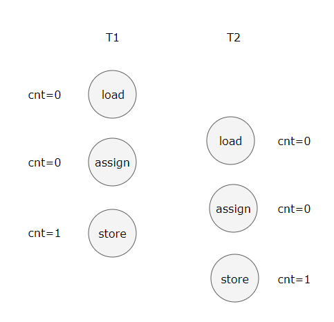

AtomicInteger 能保证多个线程修改的原子性。

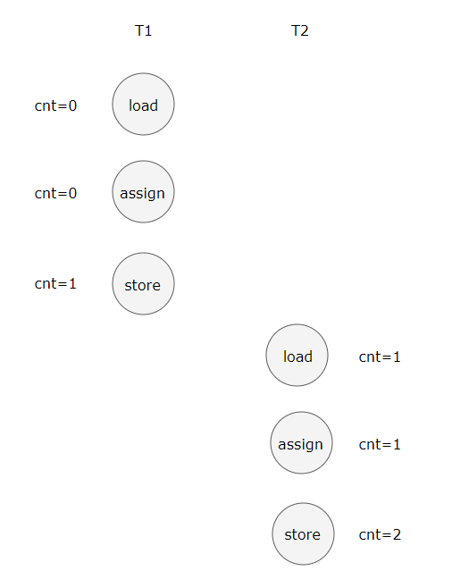

使用 AtomicInteger 重写之前线程不安全的代码之后得到以下线程安全实现：

```java
public class AtomicExample {
    private AtomicInteger cnt = new AtomicInteger();

    public void add() {
        cnt.incrementAndGet();
    }

    public int get() {
        return cnt.get();
    }
}
```

```java
public static void main(String[] args) throws InterruptedException {
    final int threadSize = 1000;
    AtomicExample example = new AtomicExample(); // 只修改这条语句
    final CountDownLatch countDownLatch = new CountDownLatch(threadSize);
    ExecutorService executorService = Executors.newCachedThreadPool();
    for (int i = 0; i < threadSize; i++) {
        executorService.execute(() -> {
            example.add();
            countDownLatch.countDown();
        });
    }
    countDownLatch.await();
    executorService.shutdown();
    System.out.println(example.get());
}
```

```html
1000
```

除了使用原子类之外，也可以使用 synchronized 互斥锁来保证操作的原子性。它对应的内存间交互操作为：lock 和 unlock，在虚拟机实现上对应的字节码指令为 monitorenter 和 monitorexit。

```java
public class AtomicSynchronizedExample {
    private int cnt = 0;

    public synchronized void add() {
        cnt++;
    }

    public synchronized int get() {
        return cnt;
    }
}
```

```java
public static void main(String[] args) throws InterruptedException {
    final int threadSize = 1000;
    AtomicSynchronizedExample example = new AtomicSynchronizedExample();
    final CountDownLatch countDownLatch = new CountDownLatch(threadSize);
    ExecutorService executorService = Executors.newCachedThreadPool();
    for (int i = 0; i < threadSize; i++) {
        executorService.execute(() -> {
            example.add();
            countDownLatch.countDown();
        });
    }
    countDownLatch.await();
    executorService.shutdown();
    System.out.println(example.get());
}
```

```html
1000
```

**2. 可见性**

可见性指当一个线程修改了共享变量的值，其它线程能够立即得知这个修改。Java 内存模型是通过在变量修改后将新值同步回主内存，在变量读取前从主内存刷新变量值来实现可见性的。

主要有有三种实现可见性的方式：

- volatile
- synchronized，对一个变量执行 unlock 操作之前，必须把变量值同步回主内存。
- final，被 final 关键字修饰的字段在构造器中一旦初始化完成，并且没有发生 this 逃逸（其它线程通过 this 引用访问到初始化了一半的对象），那么其它线程就能看见 final 字段的值。

对前面的线程不安全示例中的 cnt 变量使用 volatile 修饰，不能解决线程不安全问题，因为 volatile 并不能保证操作的原子性。

**3. 有序性**

有序性是指：在本线程内观察，所有操作都是有序的。在一个线程观察另一个线程，所有操作都是无序的，无序是因为发生了指令重排序。在 Java 内存模型中，允许编译器和处理器对指令进行重排序，重排序过程不会影响到单线程程序的执行，却会影响到多线程并发执行的正确性。

volatile 关键字通过添加内存屏障的方式来禁止指令重排，即重排序时不能把后面的指令放到内存屏障之前。

也可以通过 synchronized 来保证有序性，它保证每个时刻只有一个线程执行同步代码，相当于是让线程顺序执行同步代码。

#### 16.10.4 先行发生原则

上面提到了可以用 volatile 和 synchronized 来保证有序性。除此之外，JVM 还规定了先行发生原则，让一个操作无需控制就能先于另一个操作完成。

**1. 单一线程原则**

> Single Thread rule

在一个线程内，在程序前面的操作先行发生于后面的操作。

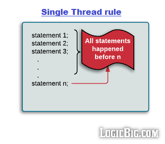

**2. 管程锁定规则**

> Monitor Lock Rule

一个 unlock 操作先行发生于后面对同一个锁的 lock 操作。

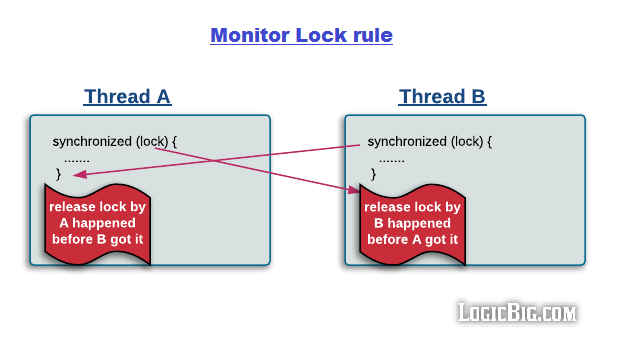

**3. volatile 变量规则**

> Volatile Variable Rule

对一个 volatile 变量的写操作先行发生于后面对这个变量的读操作。

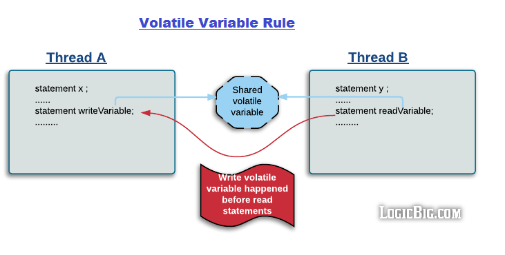

**4. 线程启动规则**

> Thread Start Rule

Thread 对象的 start() 方法调用先行发生于此线程的每一个动作。

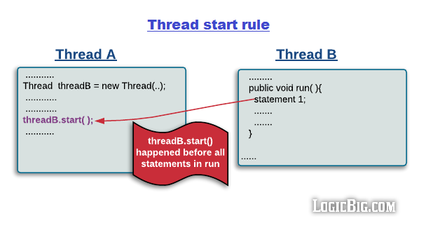

**5. 线程加入规则**

> Thread Join Rule

Thread 对象的结束先行发生于 join() 方法返回。

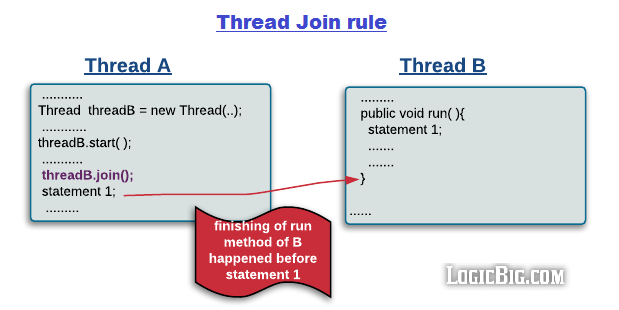

**6. 线程中断规则**

> Thread Interruption Rule

对线程 interrupt() 方法的调用先行发生于被中断线程的代码检测到中断事件的发生，可以通过 interrupted() 方法检测到是否有中断发生。

**7. 对象终结规则**

> Finalizer Rule

一个对象的初始化完成（构造函数执行结束）先行发生于它的 finalize() 方法的开始。

**8. 传递性**

> Transitivity

如果操作 A 先行发生于操作 B，操作 B 先行发生于操作 C，那么操作 A 先行发生于操作 C。

### 16.11 线程安全

多个线程不管以何种方式访问某个类，并在在主调代码中不需要进行同步，都能表现正确的行为。

线程安全有以下几种实现方式：

#### 16.11.1 不可变

不可变（Immutable）的对象一定是线程安全的，不需要再采取任何的线程安全保障措施。只要一个不可变的对象被正确地构建出来，永远也不会看到它在多个线程之中处于不一致的状态。多线程环境下，应当尽量使对象成为不可变，来满足线程安全。

不可变的类型：

- final 关键字修饰的基本数据类型
- String
- 枚举类型
- Number 部分子类，如 Long 和 Double 等数值包装类型，BigInteger 和 BigDecimal 等大数据类型。但同为 Number 的原子类 AtomicInteger 和 AtomicLong 则是可变的。

对于集合类型，可以使用 Collections.unmodifiableXXX() 方法来获取一个不可变的集合。

```java
public class ImmutableExample {
    public static void main(String[] args) {
        Map<String, Integer> map = new HashMap<>();
        Map<String, Integer> unmodifiableMap = Collections.unmodifiableMap(map);
        unmodifiableMap.put("a", 1);
    }
}
```

```html
Exception in thread "main" java.lang.UnsupportedOperationException
    at java.util.Collections$UnmodifiableMap.put(Collections.java:1457)
    at ImmutableExample.main(ImmutableExample.java:9)
```

Collections.unmodifiableXXX() 先对原始的集合进行拷贝，需要对集合进行修改的方法都直接抛出异常。

```java
public V put(K key, V value) {
    throw new UnsupportedOperationException();
}
```

#### 16.11.2 互斥同步

synchronized 和 ReentrantLock。

#### 16.11.3 非阻塞同步

互斥同步最主要的问题就是线程阻塞和唤醒所带来的性能问题，因此这种同步也称为阻塞同步。

互斥同步属于一种悲观的并发策略，总是认为只要不去做正确的同步措施，那就肯定会出现问题。无论共享数据是否真的会出现竞争，它都要进行加锁（这里讨论的是概念模型，实际上虚拟机会优化掉很大一部分不必要的加锁）、用户态核心态转换、维护锁计数器和检查是否有被阻塞的线程需要唤醒等操作。

**1. CAS**

随着硬件指令集的发展，我们可以使用基于冲突检测的乐观并发策略：先进行操作，如果没有其它线程争用共享数据，那操作就成功了，否则采取补偿措施（不断地重试，直到成功为止）。这种乐观的并发策略的许多实现都不需要将线程阻塞，因此这种同步操作称为非阻塞同步。

乐观锁需要操作和冲突检测这两个步骤具备原子性，这里就不能再使用互斥同步来保证了，只能靠硬件来完成。硬件支持的原子性操作最典型的是：比较并交换（Compare-and-Swap，CAS）。CAS 指令需要有 3 个操作数，分别是内存地址 V、旧的预期值 A 和新值 B。当执行操作时，只有当 V 的值等于 A，才将 V 的值更新为 B。

**2. AtomicInteger**

J.U.C 包里面的整数原子类 AtomicInteger 的方法调用了 Unsafe 类的 CAS 操作。

以下代码使用了 AtomicInteger 执行了自增的操作。

```java
private AtomicInteger cnt = new AtomicInteger();

public void add() {
    cnt.incrementAndGet();
}
```

以下代码是 incrementAndGet() 的源码，它调用了 Unsafe 的 getAndAddInt() 。

```java
public final int incrementAndGet() {
    return unsafe.getAndAddInt(this, valueOffset, 1) + 1;
}
```

以下代码是 getAndAddInt() 源码，var1 指示对象内存地址，var2 指示该字段相对对象内存地址的偏移，var4 指示操作需要加的数值，这里为 1。通过 getIntVolatile(var1, var2) 得到旧的预期值，通过调用 compareAndSwapInt() 来进行 CAS 比较，如果该字段内存地址中的值等于 var5，那么就更新内存地址为 var1+var2 的变量为 var5+var4。

可以看到 getAndAddInt() 在一个循环中进行，发生冲突的做法是不断的进行重试。

```java
public final int getAndAddInt(Object var1, long var2, int var4) {
    int var5;
    do {
        var5 = this.getIntVolatile(var1, var2);
    } while(!this.compareAndSwapInt(var1, var2, var5, var5 + var4));

    return var5;
}
```

**3. ABA**

如果一个变量初次读取的时候是 A 值，它的值被改成了 B，后来又被改回为 A，那 CAS 操作就会误认为它从来没有被改变过。

J.U.C 包提供了一个带有标记的原子引用类 AtomicStampedReference 来解决这个问题，它可以通过控制变量值的版本来保证 CAS 的正确性。大部分情况下 ABA 问题不会影响程序并发的正确性，如果需要解决 ABA 问题，改用传统的互斥同步可能会比原子类更高效。

#### 16.11.4 无同步方案

要保证线程安全，并不是一定就要进行同步。如果一个方法本来就不涉及共享数据，那它自然就无须任何同步措施去保证正确性。

**1. 栈封闭**

多个线程访问同一个方法的局部变量时，不会出现线程安全问题，因为局部变量存储在虚拟机栈中，属于线程私有的。

```java
public class StackClosedExample {
    public void add100() {
        int cnt = 0;
        for (int i = 0; i < 100; i++) {
            cnt++;
        }
        System.out.println(cnt);
    }
}
```

```java
public static void main(String[] args) {
    StackClosedExample example = new StackClosedExample();
    ExecutorService executorService = Executors.newCachedThreadPool();
    executorService.execute(() -> example.add100());
    executorService.execute(() -> example.add100());
    executorService.shutdown();
}
```

```html
100
100
```

**2. 线程本地存储（Thread Local Storage）**

如果一段代码中所需要的数据必须与其他代码共享，那就看看这些共享数据的代码是否能保证在同一个线程中执行。如果能保证，我们就可以把共享数据的可见范围限制在同一个线程之内，这样，无须同步也能保证线程之间不出现数据争用的问题。

符合这种特点的应用并不少见，大部分使用消费队列的架构模式（如“生产者-消费者”模式）都会将产品的消费过程尽量在一个线程中消费完。其中最重要的一个应用实例就是经典 Web 交互模型中的“一个请求对应一个服务器线程”（Thread-per-Request）的处理方式，这种处理方式的广泛应用使得很多 Web 服务端应用都可以使用线程本地存储来解决线程安全问题。

可以使用 java.lang.ThreadLocal 类来实现线程本地存储功能。

对于以下代码，thread1 中设置 threadLocal 为 1，而 thread2 设置 threadLocal 为 2。过了一段时间之后，thread1 读取 threadLocal 依然是 1，不受 thread2 的影响。

```java
public class ThreadLocalExample {
    public static void main(String[] args) {
        ThreadLocal threadLocal = new ThreadLocal();
        Thread thread1 = new Thread(() -> {
            threadLocal.set(1);
            try {
                Thread.sleep(1000);
            } catch (InterruptedException e) {
                e.printStackTrace();
            }
            System.out.println(threadLocal.get());
            threadLocal.remove();
        });
        Thread thread2 = new Thread(() -> {
            threadLocal.set(2);
            threadLocal.remove();
        });
        thread1.start();
        thread2.start();
    }
}
```

```html
1
```

为了理解 ThreadLocal，先看以下代码：

```java
public class ThreadLocalExample1 {
    public static void main(String[] args) {
        ThreadLocal threadLocal1 = new ThreadLocal();
        ThreadLocal threadLocal2 = new ThreadLocal();
        Thread thread1 = new Thread(() -> {
            threadLocal1.set(1);
            threadLocal2.set(1);
        });
        Thread thread2 = new Thread(() -> {
            threadLocal1.set(2);
            threadLocal2.set(2);
        });
        thread1.start();
        thread2.start();
    }
}
```

它所对应的底层结构图为：


每个 Thread 都有一个 ThreadLocal.ThreadLocalMap 对象。

```java
/* ThreadLocal values pertaining to this thread. This map is maintained
 * by the ThreadLocal class. */
ThreadLocal.ThreadLocalMap threadLocals = null;
```

当调用一个 ThreadLocal 的 set(T value) 方法时，先得到当前线程的 ThreadLocalMap 对象，然后将 ThreadLocal->value 键值对插入到该 Map 中。

```java
public void set(T value) {
    Thread t = Thread.currentThread();
    ThreadLocalMap map = getMap(t);
    if (map != null)
        map.set(this, value);
    else
        createMap(t, value);
}
```

get() 方法类似。

```java
public T get() {
    Thread t = Thread.currentThread();
    ThreadLocalMap map = getMap(t);
    if (map != null) {
        ThreadLocalMap.Entry e = map.getEntry(this);
        if (e != null) {
            @SuppressWarnings("unchecked")
            T result = (T)e.value;
            return result;
        }
    }
    return setInitialValue();
}
```

ThreadLocal 从理论上讲并不是用来解决多线程并发问题的，因为根本不存在多线程竞争。

在一些场景 (尤其是使用线程池) 下，由于 ThreadLocal.ThreadLocalMap 的底层数据结构导致 ThreadLocal 有内存泄漏的情况，应该尽可能在每次使用 ThreadLocal 后手动调用 remove()，以避免出现 ThreadLocal 经典的内存泄漏甚至是造成自身业务混乱的风险。

**3. 可重入代码（Reentrant Code）**

这种代码也叫做纯代码（Pure Code），可以在代码执行的任何时刻中断它，转而去执行另外一段代码（包括递归调用它本身），而在控制权返回后，原来的程序不会出现任何错误。

可重入代码有一些共同的特征，例如不依赖存储在堆上的数据和公用的系统资源、用到的状态量都由参数中传入、不调用非可重入的方法等。

### 16.12 锁优化

这里的锁优化主要是指 JVM 对 synchronized 的优化。

#### 16.12.1 自旋锁

互斥同步进入阻塞状态的开销都很大，应该尽量避免。在许多应用中，共享数据的锁定状态只会持续很短的一段时间。自旋锁的思想是让一个线程在请求一个共享数据的锁时执行忙循环（自旋）一段时间，如果在这段时间内能获得锁，就可以避免进入阻塞状态。

自旋锁虽然能避免进入阻塞状态从而减少开销，但是它需要进行忙循环操作占用 CPU 时间，它只适用于共享数据的锁定状态很短的场景。

在 JDK 1.6 中引入了自适应的自旋锁。自适应意味着自旋的次数不再固定了，而是由前一次在同一个锁上的自旋次数及锁的拥有者的状态来决定。

#### 16.12.2 锁消除

锁消除是指对于被检测出不可能存在竞争的共享数据的锁进行消除。

锁消除主要是通过逃逸分析来支持，如果堆上的共享数据不可能逃逸出去被其它线程访问到，那么就可以把它们当成私有数据对待，也就可以将它们的锁进行消除。

对于一些看起来没有加锁的代码，其实隐式的加了很多锁。例如下面的字符串拼接代码就隐式加了锁：

```java
public static String concatString(String s1, String s2, String s3) {
    return s1 + s2 + s3;
}
```

String 是一个不可变的类，编译器会对 String 的拼接自动优化。在 JDK 1.5 之前，会转化为 StringBuffer 对象的连续 append() 操作：

```java
public static String concatString(String s1, String s2, String s3) {
    StringBuffer sb = new StringBuffer();
    sb.append(s1);
    sb.append(s2);
    sb.append(s3);
    return sb.toString();
}
```

每个 append() 方法中都有一个同步块。虚拟机观察变量 sb，很快就会发现它的动态作用域被限制在 concatString() 方法内部。也就是说，sb 的所有引用永远不会逃逸到 concatString() 方法之外，其他线程无法访问到它，因此可以进行消除。

#### 16.12.3 锁粗化

如果一系列的连续操作都对同一个对象反复加锁和解锁，频繁的加锁操作就会导致性能损耗。

上一节的示例代码中连续的 append() 方法就属于这类情况。如果虚拟机探测到由这样的一串零碎的操作都对同一个对象加锁，将会把加锁的范围扩展（粗化）到整个操作序列的外部。对于上一节的示例代码就是扩展到第一个 append() 操作之前直至最后一个 append() 操作之后，这样只需要加锁一次就可以了。

#### 16.12.4 轻量级锁

JDK 1.6 引入了偏向锁和轻量级锁，从而让锁拥有了四个状态：无锁状态（unlocked）、偏向锁状态（biasble）、轻量级锁状态（lightweight locked）和重量级锁状态（inflated）。

以下是 HotSpot 虚拟机对象头的内存布局，这些数据被称为 Mark Word。其中 tag bits 对应了五个状态，这些状态在右侧的 state 表格中给出。除了 marked for gc 状态，其它四个状态已经在前面介绍过了。


下图左侧是一个线程的虚拟机栈，其中有一部分称为 Lock Record 的区域，这是在轻量级锁运行过程创建的，用于存放锁对象的 Mark Word。而右侧就是一个锁对象，包含了 Mark Word 和其它信息。

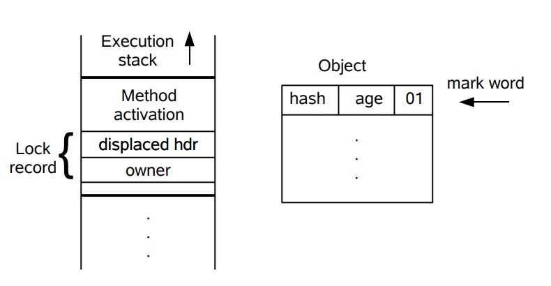

轻量级锁是相对于传统的重量级锁而言，它使用 CAS 操作来避免重量级锁使用互斥量的开销。对于绝大部分的锁，在整个同步周期内都是不存在竞争的，因此也就不需要都使用互斥量进行同步，可以先采用 CAS 操作进行同步，如果 CAS 失败了再改用互斥量进行同步。

当尝试获取一个锁对象时，如果锁对象标记为 0 01，说明锁对象的锁未锁定（unlocked）状态。此时虚拟机在当前线程的虚拟机栈中创建 Lock Record，然后使用 CAS 操作将对象的 Mark Word 更新为 Lock Record 指针。如果 CAS 操作成功了，那么线程就获取了该对象上的锁，并且对象的 Mark Word 的锁标记变为 00，表示该对象处于轻量级锁状态。

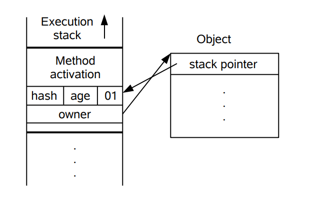

如果 CAS 操作失败了，虚拟机首先会检查对象的 Mark Word 是否指向当前线程的虚拟机栈，如果是的话说明当前线程已经拥有了这个锁对象，那就可以直接进入同步块继续执行，否则说明这个锁对象已经被其他线程线程抢占了。如果有两条以上的线程争用同一个锁，那轻量级锁就不再有效，要膨胀为重量级锁。

#### 16.12.5 偏向锁

偏向锁的思想是偏向于让第一个获取锁对象的线程，这个线程在之后获取该锁就不再需要进行同步操作，甚至连 CAS 操作也不再需要。

当锁对象第一次被线程获得的时候，进入偏向状态，标记为 1 01。同时使用 CAS 操作将线程 ID 记录到 Mark Word 中，如果 CAS 操作成功，这个线程以后每次进入这个锁相关的同步块就不需要再进行任何同步操作。

当有另外一个线程去尝试获取这个锁对象时，偏向状态就宣告结束，此时撤销偏向（Revoke Bias）后恢复到未锁定状态或者轻量级锁状态。


### 16.13 多线程开发良好的实践

- 给线程起个有意义的名字，这样可以方便找 Bug。

- 缩小同步范围，从而减少锁争用。例如对于 synchronized，应该尽量使用同步块而不是同步方法。

- 多用同步工具少用 wait() 和 notify()。首先，CountDownLatch, CyclicBarrier, Semaphore 和 Exchanger 这些同步类简化了编码操作，而用 wait() 和 notify() 很难实现复杂控制流；其次，这些同步类是由最好的企业编写和维护，在后续的 JDK 中还会不断优化和完善。

- 使用 BlockingQueue 实现生产者消费者问题。

- 多用并发集合少用同步集合，例如应该使用 ConcurrentHashMap 而不是 Hashtable。

- 使用本地变量和不可变类来保证线程安全。

- 使用线程池而不是直接创建线程，这是因为创建线程代价很高，线程池可以有效地利用有限的线程来启动任务。


## 十七、JVM


### 17.1 运行时数据区域

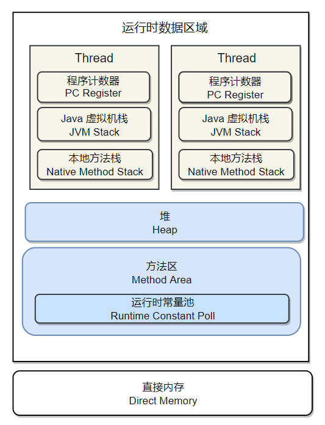

#### 17.1.1 程序计数器

记录正在执行的虚拟机字节码指令的地址（如果正在执行的是本地方法则为空）。

#### 17.1.2 Java 虚拟机栈

每个 Java 方法在执行的同时会创建一个栈帧用于存储局部变量表、操作数栈、常量池引用等信息。从方法调用直至执行完成的过程，就对应着一个栈帧在 Java 虚拟机栈中入栈和出栈的过程。

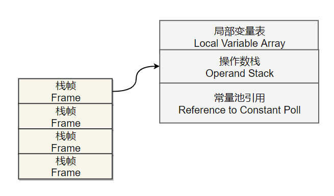

可以通过 -Xss 这个虚拟机参数来指定每个线程的 Java 虚拟机栈内存大小：

```java
java -Xss512M HackTheJava
```

该区域可能抛出以下异常：

- 当线程请求的栈深度超过最大值，会抛出 StackOverflowError 异常；
- 栈进行动态扩展时如果无法申请到足够内存，会抛出 OutOfMemoryError 异常。

#### 17.1.3 本地方法栈

本地方法栈与 Java 虚拟机栈类似，它们之间的区别只不过是本地方法栈为本地方法服务。

本地方法一般是用其它语言（C、C++ 或汇编语言等）编写的，并且被编译为基于本机硬件和操作系统的程序，对待这些方法需要特别处理。

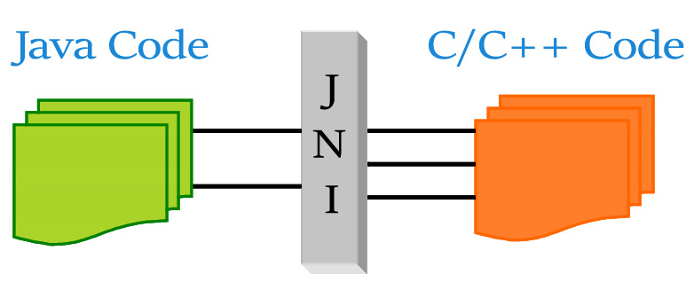

#### 17.1.4 堆

所有对象都在这里分配内存，是垃圾收集的主要区域（"GC 堆"）。

现代的垃圾收集器基本都是采用分代收集算法，其主要的思想是针对不同类型的对象采取不同的垃圾回收算法，可以将堆分成两块：

- 新生代（Young Generation）
- 老年代（Old Generation）

堆不需要连续内存，并且可以动态增加其内存，增加失败会抛出 OutOfMemoryError 异常。

可以通过 -Xms 和 -Xmx 两个虚拟机参数来指定一个程序的堆内存大小，第一个参数设置初始值，第二个参数设置最大值。

```java
java -Xms1M -Xmx2M HackTheJava
```

#### 17.1.5 方法区

用于存放已被加载的类信息、常量、静态变量、即时编译器编译后的代码等数据。

和堆一样不需要连续的内存，并且可以动态扩展，动态扩展失败一样会抛出 OutOfMemoryError 异常。

对这块区域进行垃圾回收的主要目标是对常量池的回收和对类的卸载，但是一般比较难实现。

HotSpot 虚拟机把它当成永久代来进行垃圾回收。但是很难确定永久代的大小，因为它受到很多因素影响，并且每次 Full GC 之后永久代的大小都会改变，所以经常会抛出 OutOfMemoryError 异常。为了更容易管理方法区，从 JDK 1.8 开始，移除永久代，并把方法区移至元空间，它位于本地内存中，而不是虚拟机内存中。

#### 17.1.6 运行时常量池

运行时常量池是方法区的一部分。

Class 文件中的常量池（编译器生成的各种字面量和符号引用）会在类加载后被放入这个区域。

除了在编译期生成的常量，还允许动态生成，例如 String 类的 intern()。

#### 17.1.7 直接内存

在 JDK 1.4 中新加入了 NIO 类，它可以使用 Native 函数库直接分配堆外内存（Native 堆），然后通过一个存储在 Java 堆里的 DirectByteBuffer 对象作为这块内存的引用进行操作。

这样能在一些场景中显著提高性能，因为避免了在 Java 堆和 Native 堆中来回复制数据。

### 17.2 垃圾收集

垃圾收集主要是针对堆和方法区进行。

程序计数器、虚拟机栈和本地方法栈这三个区域属于线程私有的，只存在于线程的生命周期内，线程结束之后也会消失，因此不需要对这三个区域进行垃圾回收。

#### 17.2.1 判断一个对象是否可被回收

**1. 引用计数算法**

给对象添加一个引用计数器，当对象增加一个引用时计数器加 1，引用失效时计数器减 1。引用计数为 0 的对象可被回收。

两个对象出现循环引用的情况下，此时引用计数器永远不为 0，导致无法对它们进行回收。

正因为循环引用的存在，因此 Java 虚拟机不使用引用计数算法。

```java
public class ReferenceCountingGC {

    public Object instance = null;

    public static void main(String[] args) {
        ReferenceCountingGC objectA = new ReferenceCountingGC();
        ReferenceCountingGC objectB = new ReferenceCountingGC();
        objectA.instance = objectB;
        objectB.instance = objectA;
    }
}
```

**2. 可达性分析算法**

通过 GC Roots 作为起始点进行搜索，能够到达到的对象都是存活的，不可达的对象可被回收。

Java 虚拟机使用该算法来判断对象是否可被回收，在 Java 中 GC Roots 一般包含以下内容：

- 虚拟机栈中局部变量表中引用的对象
- 本地方法栈中 JNI 中引用的对象
- 方法区中类静态属性引用的对象
- 方法区中的常量引用的对象


**3. 方法区的回收**

因为方法区主要存放永久代对象，而永久代对象的回收率比新生代低很多，因此在方法区上进行回收性价比不高。

主要是对常量池的回收和对类的卸载。

在大量使用反射、动态代理、CGLib 等 ByteCode 框架、动态生成 JSP 以及 OSGi 这类频繁自定义 ClassLoader 的场景都需要虚拟机具备类卸载功能，以保证不会出现内存溢出。

类的卸载条件很多，需要满足以下三个条件，并且满足了也不一定会被卸载：

- 该类所有的实例都已经被回收，也就是堆中不存在该类的任何实例。
- 加载该类的 ClassLoader 已经被回收。
- 该类对应的 Class 对象没有在任何地方被引用，也就无法在任何地方通过反射访问该类方法。

可以通过 -Xnoclassgc 参数来控制是否对类进行卸载。

**4. finalize()**

finalize() 类似 C++ 的析构函数，用来做关闭外部资源等工作。但是 try-finally 等方式可以做的更好，并且该方法运行代价高昂，不确定性大，无法保证各个对象的调用顺序，因此最好不要使用。

当一个对象可被回收时，如果需要执行该对象的 finalize() 方法，那么就有可能在该方法中让对象重新被引用，从而实现自救。自救只能进行一次，如果回收的对象之前调用了 finalize() 方法自救，后面回收时不会调用 finalize() 方法。

#### 17.2.2 引用类型

无论是通过引用计算算法判断对象的引用数量，还是通过可达性分析算法判断对象是否可达，判定对象是否可被回收都与引用有关。

Java 提供了四种强度不同的引用类型。

**1. 强引用**

被强引用关联的对象不会被回收。

使用 new 一个新对象的方式来创建强引用。

```java
Object obj = new Object();
```

**2. 软引用**

被软引用关联的对象只有在内存不够的情况下才会被回收。

使用 SoftReference 类来创建软引用。

```java
Object obj = new Object();
SoftReference<Object> sf = new SoftReference<Object>(obj);
obj = null;  // 使对象只被软引用关联
```

**3. 弱引用**

被弱引用关联的对象一定会被回收，也就是说它只能存活到下一次垃圾回收发生之前。

使用 WeakReference 类来实现弱引用。

```java
Object obj = new Object();
WeakReference<Object> wf = new WeakReference<Object>(obj);
obj = null;
```

**4. 虚引用**

又称为幽灵引用或者幻影引用。一个对象是否有虚引用的存在，完全不会对其生存时间构成影响，也无法通过虚引用取得一个对象。

为一个对象设置虚引用关联的唯一目的就是能在这个对象被回收时收到一个系统通知。

使用 PhantomReference 来实现虚引用。

```java
Object obj = new Object();
PhantomReference<Object> pf = new PhantomReference<Object>(obj);
obj = null;
```

#### 17.2.3 垃圾收集算法

**1. 标记 - 清除**


将存活的对象进行标记，然后清理掉未被标记的对象。

不足：

- 标记和清除过程效率都不高；
- 会产生大量不连续的内存碎片，导致无法给大对象分配内存。

**2. 标记 - 整理**

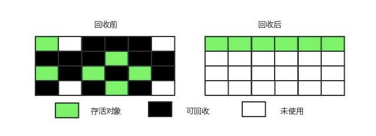

让所有存活的对象都向一端移动，然后直接清理掉端边界以外的内存。

**3. 复制**


将内存划分为大小相等的两块，每次只使用其中一块，当这一块内存用完了就将还存活的对象复制到另一块上面，然后再把使用过的内存空间进行一次清理。

主要不足是只使用了内存的一半。

现在的商业虚拟机都采用这种收集算法来回收新生代，但是并不是将新生代划分为大小相等的两块，而是分为一块较大的 Eden 空间和两块较小的 Survivor 空间，每次使用 Eden 空间和其中一块 Survivor。在回收时，将 Eden 和 Survivor 中还存活着的对象一次性复制到另一块 Survivor 空间上，最后清理 Eden 和使用过的那一块 Survivor。

HotSpot 虚拟机的 Eden 和 Survivor 的大小比例默认为 8:1，保证了内存的利用率达到 90%。如果每次回收有多于 10% 的对象存活，那么一块 Survivor 空间就不够用了，此时需要依赖于老年代进行分配担保，也就是借用老年代的空间存储放不下的对象。

**4. 分代收集**

现在的商业虚拟机采用分代收集算法，它根据对象存活周期将内存划分为几块，不同块采用适当的收集算法。

一般将堆分为新生代和老年代。

- 新生代使用：复制算法
- 老年代使用：标记 - 清除 或者 标记 - 整理 算法

#### 17.2.4 垃圾收集器


以上是 HotSpot 虚拟机中的 7 个垃圾收集器，连线表示垃圾收集器可以配合使用。

- 单线程与多线程：单线程指的是垃圾收集器只使用一个线程进行收集，而多线程使用多个线程；
- 串行与并行：串行指的是垃圾收集器与用户程序交替执行，这意味着在执行垃圾收集的时候需要停顿用户程序；并行指的是垃圾收集器和用户程序同时执行。除了 CMS 和 G1 之外，其它垃圾收集器都是以串行的方式执行。

**1. Serial 收集器**


Serial 翻译为串行，也就是说它以串行的方式执行。

它是单线程的收集器，只会使用一个线程进行垃圾收集工作。

它的优点是简单高效，对于单个 CPU 环境来说，由于没有线程交互的开销，因此拥有最高的单线程收集效率。

它是 Client 模式下的默认新生代收集器，因为在该应用场景下，分配给虚拟机管理的内存一般来说不会很大。Serial 收集器收集几十兆甚至一两百兆的新生代停顿时间可以控制在一百多毫秒以内，只要不是太频繁，这点停顿是可以接受的。

**2. ParNew 收集器**


它是 Serial 收集器的多线程版本。

是 Server 模式下的虚拟机首选新生代收集器，除了性能原因外，主要是因为除了 Serial 收集器，只有它能与 CMS 收集器配合工作。

默认开启的线程数量与 CPU 数量相同，可以使用 -XX:ParallelGCThreads 参数来设置线程数。

**3. Parallel Scavenge 收集器**

与 ParNew 一样是多线程收集器。

其它收集器关注点是尽可能缩短垃圾收集时用户线程的停顿时间，而它的目标是达到一个可控制的吞吐量，它被称为“吞吐量优先”收集器。这里的吞吐量指 CPU 用于运行用户代码的时间占总时间的比值。

停顿时间越短就越适合需要与用户交互的程序，良好的响应速度能提升用户体验。而高吞吐量则可以高效率地利用 CPU 时间，尽快完成程序的运算任务，适合在后台运算而不需要太多交互的任务。

缩短停顿时间是以牺牲吞吐量和新生代空间来换取的：新生代空间变小，垃圾回收变得频繁，导致吞吐量下降。

可以通过一个开关参数打开 GC 自适应的调节策略（GC Ergonomics），就不需要手工指定新生代的大小（-Xmn）、Eden 和 Survivor 区的比例、晋升老年代对象年龄等细节参数了。虚拟机会根据当前系统的运行情况收集性能监控信息，动态调整这些参数以提供最合适的停顿时间或者最大的吞吐量。

**4. Serial Old 收集器**


是 Serial 收集器的老年代版本，也是给 Client 模式下的虚拟机使用。如果用在 Server 模式下，它有两大用途：

- 在 JDK 1.5 以及之前版本（Parallel Old 诞生以前）中与 Parallel Scavenge 收集器搭配使用。
- 作为 CMS 收集器的后备预案，在并发收集发生 Concurrent Mode Failure 时使用。

**5. Parallel Old 收集器**


是 Parallel Scavenge 收集器的老年代版本。

在注重吞吐量以及 CPU 资源敏感的场合，都可以优先考虑 Parallel Scavenge 加 Parallel Old 收集器。

**6. CMS 收集器**


CMS（Concurrent Mark Sweep），Mark Sweep 指的是标记 - 清除算法。

分为以下四个流程：

- 初始标记：仅仅只是标记一下 GC Roots 能直接关联到的对象，速度很快，需要停顿。
- 并发标记：进行 GC Roots Tracing 的过程，它在整个回收过程中耗时最长，不需要停顿。
- 重新标记：为了修正并发标记期间因用户程序继续运作而导致标记产生变动的那一部分对象的标记记录，需要停顿。
- 并发清除：不需要停顿。

在整个过程中耗时最长的并发标记和并发清除过程中，收集器线程都可以与用户线程一起工作，不需要进行停顿。

具有以下缺点：

- 吞吐量低：低停顿时间是以牺牲吞吐量为代价的，导致 CPU 利用率不够高。
- 无法处理浮动垃圾，可能出现 Concurrent Mode Failure。浮动垃圾是指并发清除阶段由于用户线程继续运行而产生的垃圾，这部分垃圾只能到下一次 GC 时才能进行回收。由于浮动垃圾的存在，因此需要预留出一部分内存，意味着 CMS 收集不能像其它收集器那样等待老年代快满的时候再回收。如果预留的内存不够存放浮动垃圾，就会出现 Concurrent Mode Failure，这时虚拟机将临时启用 Serial Old 来替代 CMS。
- 标记 - 清除算法导致的空间碎片，往往出现老年代空间剩余，但无法找到足够大连续空间来分配当前对象，不得不提前触发一次 Full GC。

**7. G1 收集器**

G1（Garbage-First），它是一款面向服务端应用的垃圾收集器，在多 CPU 和大内存的场景下有很好的性能。HotSpot 开发团队赋予它的使命是未来可以替换掉 CMS 收集器。

堆被分为新生代和老年代，其它收集器进行收集的范围都是整个新生代或者老年代，而 G1 可以直接对新生代和老年代一起回收。


G1 把堆划分成多个大小相等的独立区域（Region），新生代和老年代不再物理隔离。


通过引入 Region 的概念，从而将原来的一整块内存空间划分成多个的小空间，使得每个小空间可以单独进行垃圾回收。这种划分方法带来了很大的灵活性，使得可预测的停顿时间模型成为可能。通过记录每个 Region 垃圾回收时间以及回收所获得的空间（这两个值是通过过去回收的经验获得），并维护一个优先列表，每次根据允许的收集时间，优先回收价值最大的 Region。

每个 Region 都有一个 Remembered Set，用来记录该 Region 对象的引用对象所在的 Region。通过使用 Remembered Set，在做可达性分析的时候就可以避免全堆扫描。


如果不计算维护 Remembered Set 的操作，G1 收集器的运作大致可划分为以下几个步骤：

- 初始标记
- 并发标记
- 最终标记：为了修正在并发标记期间因用户程序继续运作而导致标记产生变动的那一部分标记记录，虚拟机将这段时间对象变化记录在线程的 Remembered Set Logs 里面，最终标记阶段需要把 Remembered Set Logs 的数据合并到 Remembered Set 中。这阶段需要停顿线程，但是可并行执行。
- 筛选回收：首先对各个 Region 中的回收价值和成本进行排序，根据用户所期望的 GC 停顿时间来制定回收计划。此阶段其实也可以做到与用户程序一起并发执行，但是因为只回收一部分 Region，时间是用户可控制的，而且停顿用户线程将大幅度提高收集效率。

具备如下特点：

- 空间整合：整体来看是基于“标记 - 整理”算法实现的收集器，从局部（两个 Region 之间）上来看是基于“复制”算法实现的，这意味着运行期间不会产生内存空间碎片。
- 可预测的停顿：能让使用者明确指定在一个长度为 M 毫秒的时间片段内，消耗在 GC 上的时间不得超过 N 毫秒。

### 17.3 内存分配与回收策略

#### 17.3.1 Minor GC 和 Full GC

- Minor GC：发生在新生代上，因为新生代对象存活时间很短，因此 Minor GC 会频繁执行，执行的速度一般也会比较快。

- Full GC：发生在老年代上，老年代对象其存活时间长，因此 Full GC 很少执行，执行速度会比 Minor GC 慢很多。

#### 17.3.2 内存分配策略

**1. 对象优先在 Eden 分配**

大多数情况下，对象在新生代 Eden 区分配，当 Eden 区空间不够时，发起 Minor GC。

**2. 大对象直接进入老年代**

大对象是指需要连续内存空间的对象，最典型的大对象是那种很长的字符串以及数组。

经常出现大对象会提前触发垃圾收集以获取足够的连续空间分配给大对象。

-XX:PretenureSizeThreshold，大于此值的对象直接在老年代分配，避免在 Eden 区和 Survivor 区之间的大量内存复制。

**3. 长期存活的对象进入老年代**

为对象定义年龄计数器，对象在 Eden 出生并经过 Minor GC 依然存活，将移动到 Survivor 中，年龄就增加 1 岁，增加到一定年龄则移动到老年代中。

-XX:MaxTenuringThreshold 用来定义年龄的阈值。

**4. 动态对象年龄判定**

虚拟机并不是永远地要求对象的年龄必须达到 MaxTenuringThreshold 才能晋升老年代，如果在 Survivor 中相同年龄所有对象大小的总和大于 Survivor 空间的一半，则年龄大于或等于该年龄的对象可以直接进入老年代，无需等到 MaxTenuringThreshold 中要求的年龄。

**5. 空间分配担保**

在发生 Minor GC 之前，虚拟机先检查老年代最大可用的连续空间是否大于新生代所有对象总空间，如果条件成立的话，那么 Minor GC 可以确认是安全的。

如果不成立的话虚拟机会查看 HandlePromotionFailure 设置值是否允许担保失败，如果允许那么就会继续检查老年代最大可用的连续空间是否大于历次晋升到老年代对象的平均大小，如果大于，将尝试着进行一次 Minor GC；如果小于，或者 HandlePromotionFailure 设置不允许冒险，那么就要进行一次 Full GC。

#### 17.3.3 Full GC 的触发条件

对于 Minor GC，其触发条件非常简单，当 Eden 空间满时，就将触发一次 Minor GC。而 Full GC 则相对复杂，有以下条件：

**1. 调用 System.gc()**

只是建议虚拟机执行 Full GC，但是虚拟机不一定真正去执行。不建议使用这种方式，而是让虚拟机管理内存。

**2. 老年代空间不足**

老年代空间不足的常见场景为前文所讲的大对象直接进入老年代、长期存活的对象进入老年代等。

为了避免以上原因引起的 Full GC，应当尽量不要创建过大的对象以及数组。除此之外，可以通过 -Xmn 虚拟机参数调大新生代的大小，让对象尽量在新生代被回收掉，不进入老年代。还可以通过 -XX:MaxTenuringThreshold 调大对象进入老年代的年龄，让对象在新生代多存活一段时间。

**3. 空间分配担保失败**

使用复制算法的 Minor GC 需要老年代的内存空间作担保，如果担保失败会执行一次 Full GC。具体内容请参考上面的第五小节。

**4. JDK 1.7 及以前的永久代空间不足**

在 JDK 1.7 及以前，HotSpot 虚拟机中的方法区是用永久代实现的，永久代中存放的为一些 Class 的信息、常量、静态变量等数据。

当系统中要加载的类、反射的类和调用的方法较多时，永久代可能会被占满，在未配置为采用 CMS GC 的情况下也会执行 Full GC。如果经过 Full GC 仍然回收不了，那么虚拟机会抛出 java.lang.OutOfMemoryError。

为避免以上原因引起的 Full GC，可采用的方法为增大永久代空间或转为使用 CMS GC。

**5. Concurrent Mode Failure**

执行 CMS GC 的过程中同时有对象要放入老年代，而此时老年代空间不足（可能是 GC 过程中浮动垃圾过多导致暂时性的空间不足），便会报 Concurrent Mode Failure 错误，并触发 Full GC。

### 17.4 类加载机制

类是在运行期间第一次使用时动态加载的，而不是编译时期一次性加载。因为如果在编译时期一次性加载，那么会占用很多的内存。

#### 17.4.1 类的生命周期


包括以下 7 个阶段：

-  **加载（Loading）** 
-  **验证（Verification）** 
-  **准备（Preparation）** 
-  **解析（Resolution）** 
-  **初始化（Initialization）** 
- 使用（Using）
- 卸载（Unloading）

#### 17.4.2 类加载过程

包含了加载、验证、准备、解析和初始化这 5 个阶段。

**1. 加载**

加载是类加载的一个阶段，注意不要混淆。

加载过程完成以下三件事：

- 通过一个类的全限定名来获取定义此类的二进制字节流。
- 将这个字节流所代表的静态存储结构转化为方法区的运行时存储结构。
- 在内存中生成一个代表这个类的 Class 对象，作为方法区这个类的各种数据的访问入口。

其中二进制字节流可以从以下方式中获取：

- 从 ZIP 包读取，成为 JAR、EAR、WAR 格式的基础。
- 从网络中获取，最典型的应用是 Applet。
- 运行时计算生成，例如动态代理技术，在 java.lang.reflect.Proxy 使用 ProxyGenerator.generateProxyClass 的代理类的二进制字节流。
- 由其他文件生成，例如由 JSP 文件生成对应的 Class 类。

**2. 验证**

确保 Class 文件的字节流中包含的信息符合当前虚拟机的要求，并且不会危害虚拟机自身的安全。

**3. 准备**

类变量是被 static 修饰的变量，准备阶段为类变量分配内存并设置初始值，使用的是方法区的内存。

实例变量不会在这阶段分配内存，它将会在对象实例化时随着对象一起分配在堆中。

注意，实例化不是类加载的一个过程，类加载发生在所有实例化操作之前，并且类加载只进行一次，实例化可以进行多次。

初始值一般为 0 值，例如下面的类变量 value 被初始化为 0 而不是 123。

```java
public static int value = 123;
```

如果类变量是常量，那么会按照表达式来进行初始化，而不是赋值为 0。

```java
public static final int value = 123;
```

**4. 解析**

将常量池的符号引用替换为直接引用的过程。

其中解析过程在某些情况下可以在初始化阶段之后再开始，这是为了支持 Java 的动态绑定。

**5. 初始化**

初始化阶段才真正开始执行类中定义的 Java 程序代码。初始化阶段即虚拟机执行类构造器 &lt;clinit>() 方法的过程。

在准备阶段，类变量已经赋过一次系统要求的初始值，而在初始化阶段，根据程序员通过程序制定的主观计划去初始化类变量和其它资源。

&lt;clinit>() 方法具有以下特点：

- 是由编译器自动收集类中所有类变量的赋值动作和静态语句块中的语句合并产生的，编译器收集的顺序由语句在源文件中出现的顺序决定。特别注意的是，静态语句块只能访问到定义在它之前的类变量，定义在它之后的类变量只能赋值，不能访问。例如以下代码：

```java
public class Test {
    static {
        i = 0;                // 给变量赋值可以正常编译通过
        System.out.print(i);  // 这句编译器会提示“非法向前引用”
    }
    static int i = 1;
}
```

- 与类的构造函数（或者说实例构造器 &lt;init>()）不同，不需要显式的调用父类的构造器。虚拟机会自动保证在子类的 &lt;clinit>() 方法运行之前，父类的 &lt;clinit>() 方法已经执行结束。因此虚拟机中第一个执行 &lt;clinit>() 方法的类肯定为 java.lang.Object。

- 由于父类的 &lt;clinit>() 方法先执行，也就意味着父类中定义的静态语句块的执行要优先于子类。例如以下代码：

```java
static class Parent {
    public static int A = 1;
    static {
        A = 2;
    }
}

static class Sub extends Parent {
    public static int B = A;
}

public static void main(String[] args) {
     System.out.println(Sub.B);  // 2
}
```

- &lt;clinit>() 方法对于类或接口不是必须的，如果一个类中不包含静态语句块，也没有对类变量的赋值操作，编译器可以不为该类生成 &lt;clinit>() 方法。

- 接口中不可以使用静态语句块，但仍然有类变量初始化的赋值操作，因此接口与类一样都会生成 &lt;clinit>() 方法。但接口与类不同的是，执行接口的 &lt;clinit>() 方法不需要先执行父接口的 &lt;clinit>() 方法。只有当父接口中定义的变量使用时，父接口才会初始化。另外，接口的实现类在初始化时也一样不会执行接口的 &lt;clinit>() 方法。

- 虚拟机会保证一个类的 &lt;clinit>() 方法在多线程环境下被正确的加锁和同步，如果多个线程同时初始化一个类，只会有一个线程执行这个类的 &lt;clinit>() 方法，其它线程都会阻塞等待，直到活动线程执行 &lt;clinit>() 方法完毕。如果在一个类的 &lt;clinit>() 方法中有耗时的操作，就可能造成多个线程阻塞，在实际过程中此种阻塞很隐蔽。

#### 17.4.3 类初始化时机

**1. 主动引用**

虚拟机规范中并没有强制约束何时进行加载，但是规范严格规定了有且只有下列五种情况必须对类进行初始化（加载、验证、准备都会随之发生）：

- 遇到 new、getstatic、putstatic、invokestatic 这四条字节码指令时，如果类没有进行过初始化，则必须先触发其初始化。最常见的生成这 4 条指令的场景是：使用 new 关键字实例化对象的时候；读取或设置一个类的静态字段（被 final 修饰、已在编译期把结果放入常量池的静态字段除外）的时候；以及调用一个类的静态方法的时候。

- 使用 java.lang.reflect 包的方法对类进行反射调用的时候，如果类没有进行初始化，则需要先触发其初始化。

- 当初始化一个类的时候，如果发现其父类还没有进行过初始化，则需要先触发其父类的初始化。

- 当虚拟机启动时，用户需要指定一个要执行的主类（包含 main() 方法的那个类），虚拟机会先初始化这个主类；

- 当使用 JDK 1.7 的动态语言支持时，如果一个 java.lang.invoke.MethodHandle 实例最后的解析结果为 REF_getStatic, REF_putStatic, REF_invokeStatic 的方法句柄，并且这个方法句柄所对应的类没有进行过初始化，则需要先触发其初始化；

**2. 被动引用**

以上 5 种场景中的行为称为对一个类进行主动引用。除此之外，所有引用类的方式都不会触发初始化，称为被动引用。被动引用的常见例子包括：

- 通过子类引用父类的静态字段，不会导致子类初始化。

```java
System.out.println(SubClass.value);  // value 字段在 SuperClass 中定义
```

- 通过数组定义来引用类，不会触发此类的初始化。该过程会对数组类进行初始化，数组类是一个由虚拟机自动生成的、直接继承自 Object 的子类，其中包含了数组的属性和方法。

```java
SuperClass[] sca = new SuperClass[10];
```

- 常量在编译阶段会存入调用类的常量池中，本质上并没有直接引用到定义常量的类，因此不会触发定义常量的类的初始化。

```java
System.out.println(ConstClass.HELLOWORLD);
```

#### 17.4.4 类与类加载器

两个类相等需要类本身相等，并且使用同一个类加载器进行加载。这是因为每一个类加载器都拥有一个独立的类名称空间。

这里的相等，包括类的 Class 对象的 equals() 方法、isAssignableFrom() 方法、isInstance() 方法的返回结果为 true，也包括使用 instanceof 关键字做对象所属关系判定结果为 true。

#### 17.4.5 类加载器分类

从 Java 虚拟机的角度来讲，只存在以下两种不同的类加载器：

- 启动类加载器（Bootstrap ClassLoader），这个类加载器用 C++ 实现，是虚拟机自身的一部分；

- 所有其他类的加载器，这些类由 Java 实现，独立于虚拟机外部，并且全都继承自抽象类 java.lang.ClassLoader。

从 Java 开发人员的角度看，类加载器可以划分得更细致一些：

- 启动类加载器（Bootstrap ClassLoader）此类加载器负责将存放在 &lt;JRE_HOME>\lib 目录中的，或者被 -Xbootclasspath 参数所指定的路径中的，并且是虚拟机识别的（仅按照文件名识别，如 rt.jar，名字不符合的类库即使放在 lib 目录中也不会被加载）类库加载到虚拟机内存中。启动类加载器无法被 Java 程序直接引用，用户在编写自定义类加载器时，如果需要把加载请求委派给启动类加载器，直接使用 null 代替即可。

- 扩展类加载器（Extension ClassLoader）这个类加载器是由 ExtClassLoader（sun.misc.Launcher$ExtClassLoader）实现的。它负责将 &lt;JAVA_HOME>/lib/ext 或者被 java.ext.dir 系统变量所指定路径中的所有类库加载到内存中，开发者可以直接使用扩展类加载器。

- 应用程序类加载器（Application ClassLoader）这个类加载器是由 AppClassLoader（sun.misc.Launcher$AppClassLoader）实现的。由于这个类加载器是 ClassLoader 中的 getSystemClassLoader() 方法的返回值，因此一般称为系统类加载器。它负责加载用户类路径（ClassPath）上所指定的类库，开发者可以直接使用这个类加载器，如果应用程序中没有自定义过自己的类加载器，一般情况下这个就是程序中默认的类加载器。

#### 17.4.6 双亲委派模型

应用程序都是由三种类加载器相互配合进行加载的，如果有必要，还可以加入自己定义的类加载器。

下图展示的类加载器之间的层次关系，称为类加载器的双亲委派模型（Parents Delegation Model）。该模型要求除了顶层的启动类加载器外，其余的类加载器都应有自己的父类加载器。这里类加载器之间的父子关系一般通过组合（Composition）关系来实现，而不是通过继承（Inheritance）的关系实现。


**1. 工作过程**

一个类加载器首先将类加载请求传送到父类加载器，只有当父类加载器无法完成类加载请求时才尝试加载。

**2. 好处**

使得 Java 类随着它的类加载器一起具有一种带有优先级的层次关系，从而使得基础类得到统一。

例如 java.lang.Object 存放在 rt.jar 中，如果编写另外一个 java.lang.Object 的类并放到 ClassPath 中，程序可以编译通过。由于双亲委派模型的存在，所以在 rt.jar 中的 Object 比在 ClassPath 中的 Object 优先级更高，这是因为 rt.jar 中的 Object 使用的是启动类加载器，而 ClassPath 中的 Object 使用的是应用程序类加载器。rt.jar 中的 Object 优先级更高，那么程序中所有的 Object 都是这个 Object。

**3. 实现**

以下是抽象类 java.lang.ClassLoader 的代码片段，其中的 loadClass() 方法运行过程如下：先检查类是否已经加载过，如果没有则让父类加载器去加载。当父类加载器加载失败时抛出 ClassNotFoundException，此时尝试自己去加载。

```java
public abstract class ClassLoader {
    // The parent class loader for delegation
    private final ClassLoader parent;

    public Class<?> loadClass(String name) throws ClassNotFoundException {
        return loadClass(name, false);
    }

    protected Class<?> loadClass(String name, boolean resolve) throws ClassNotFoundException {
        synchronized (getClassLoadingLock(name)) {
            // First, check if the class has already been loaded
            Class<?> c = findLoadedClass(name);
            if (c == null) {
                try {
                    if (parent != null) {
                        c = parent.loadClass(name, false);
                    } else {
                        c = findBootstrapClassOrNull(name);
                    }
                } catch (ClassNotFoundException e) {
                    // ClassNotFoundException thrown if class not found
                    // from the non-null parent class loader
                }

                if (c == null) {
                    // If still not found, then invoke findClass in order
                    // to find the class.
                    c = findClass(name);
                }
            }
            if (resolve) {
                resolveClass(c);
            }
            return c;
        }
    }

    protected Class<?> findClass(String name) throws ClassNotFoundException {
        throw new ClassNotFoundException(name);
    }
}
```

#### 17.4.7 自定义类加载器实现

FileSystemClassLoader 是自定义类加载器，继承自 java.lang.ClassLoader，用于加载文件系统上的类。它首先根据类的全名在文件系统上查找类的字节代码文件（.class 文件），然后读取该文件内容，最后通过 defineClass() 方法来把这些字节代码转换成 java.lang.Class 类的实例。

java.lang.ClassLoader 的 loadClass() 实现了双亲委派模型的逻辑，因此自定义类加载器一般不去重写它，但是需要重写 findClass() 方法。

```java
public class FileSystemClassLoader extends ClassLoader {

    private String rootDir;

    public FileSystemClassLoader(String rootDir) {
        this.rootDir = rootDir;
    }

    protected Class<?> findClass(String name) throws ClassNotFoundException {
        byte[] classData = getClassData(name);
        if (classData == null) {
            throw new ClassNotFoundException();
        } else {
            return defineClass(name, classData, 0, classData.length);
        }
    }

    private byte[] getClassData(String className) {
        String path = classNameToPath(className);
        try {
            InputStream ins = new FileInputStream(path);
            ByteArrayOutputStream baos = new ByteArrayOutputStream();
            int bufferSize = 4096;
            byte[] buffer = new byte[bufferSize];
            int bytesNumRead;
            while ((bytesNumRead = ins.read(buffer)) != -1) {
                baos.write(buffer, 0, bytesNumRead);
            }
            return baos.toByteArray();
        } catch (IOException e) {
            e.printStackTrace();
        }
        return null;
    }

    private String classNameToPath(String className) {
        return rootDir + File.separatorChar
                + className.replace('.', File.separatorChar) + ".class";
    }
}
```
